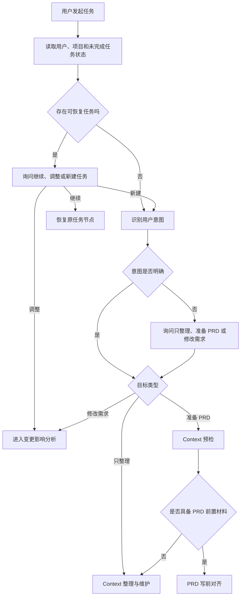
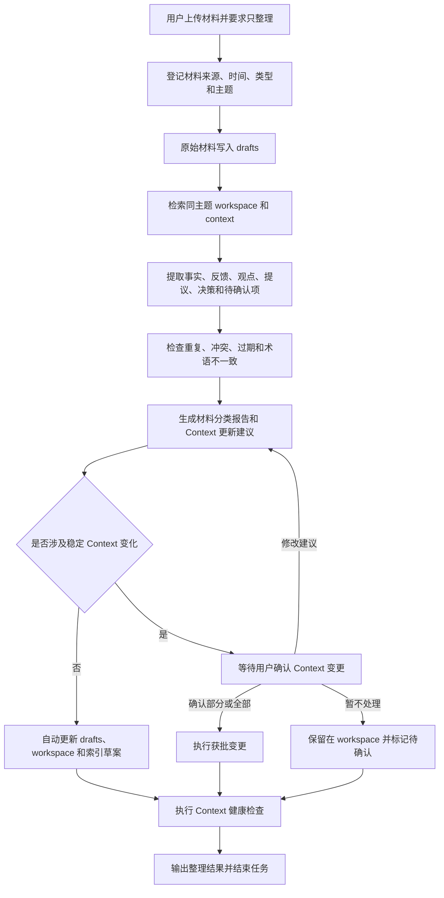
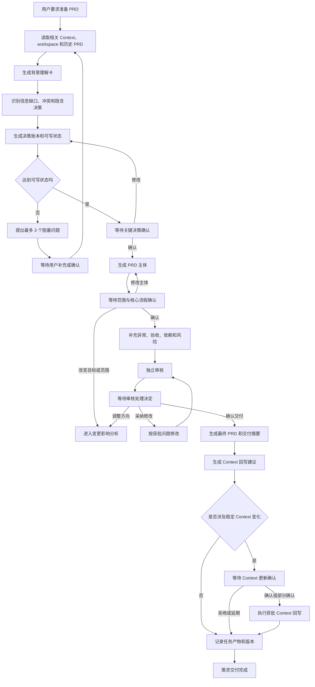
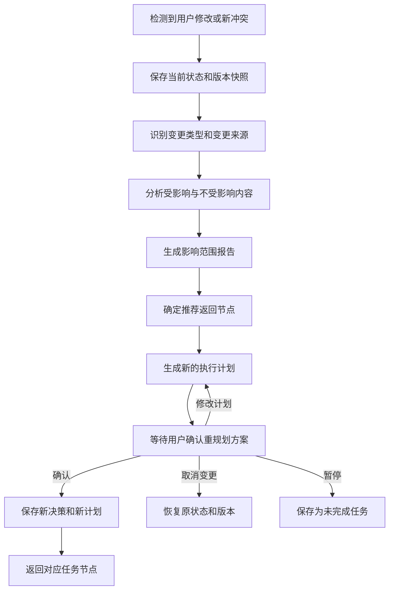

# Context 工程与需求交付协作 Agent

## 用户任务流程设计

> 版本：v0.2  
> 阶段：个人 POC  
> 更新日期：2026-08-03  
> 上游文档：《产品定义与 POC 最小验证范围》v1.1  

---

## 0. 文档目的

本文档从用户目标出发，定义 Context 工程与需求交付协作 Agent 的端到端任务流程、人工确认节点、异常处理和跨会话恢复规则。用户通过任意外部 Agent 宿主进入流程；宿主和 Gateway 只负责交互适配，业务流程以 Runtime 状态为准。

本文档只回答以下问题：

1. 用户在什么情况下进入哪类任务流程；
2. Agent 在每一步读取什么、判断什么、输出什么；
3. 哪些动作可以自动执行，哪些动作必须等待人工确认；
4. 用户修改目标或材料后，系统应该返回哪个任务节点；
5. 工具失败、材料不足、信息冲突和会话中断时如何处理。

本文档不依赖特定低代码平台或数据库节点。具体文件结构、Runtime JSON/JSONL、Skill 目录和 Harness 脚本由状态机、输入输出契约与项目骨架共同定义。

通用项目的稳定 Context 位于 `context-workspace/projects/<project_id>/context/`；帮助中心搜索仅作为可复现演示案例，继续使用 `context-workspace/context/`。两者都遵循“原始材料先进入 drafts、候选和待确认内容进入 workspace、人工确认后进入 context”的规则。

---

## 1. 参与角色

| 角色 | 职责 |
|---|---|
| 产品经理用户 | 提供材料和任务目标，确认事实、范围、关键决策及最终交付物 |
| 外部 Agent 宿主 | 负责自然语言理解、追问、展示 Runtime 结果并转发用户确认；可被替换 |
| External Agent Gateway | 校验请求、调用 Runtime、包装结构化响应，不执行业务判断 |
| 项目 Runtime Orchestrator | 唯一负责业务路由、状态机、Skill 编排、确认门禁和受控执行 |
| Context 能力模块 | 材料接入、信息分类、冲突检查、生命周期维护、索引和健康检查 |
| PRD 能力模块 | 写前对齐、两阶段写作和独立审核 |
| 变更影响模块 | 识别变更、分析影响范围、生成新计划和返回节点 |
| 本地 Agent Harness | 根据 `AGENTS.md` 加载 Context 和 Skill，约束状态、确认、写入、重试和恢复 |
| 文件型 Context 仓库 | 以 `drafts/`、`workspace/`、`context/` 保存材料、业务知识和交付产物 |
| 本地 Runtime | 以 JSON/JSONL 保存当前任务快照、待确认项和追加事件日志 |
| Git/GitHub | 追溯 Prompt、Skill、Context、文档、案例和评测版本，并展示脱敏后的 POC 作品 |

---

## 2. 全局任务入口

### 2.1 用户可能表达的目标

| 用户目标 | 示例 | 目标任务模式 |
|---|---|---|
| 只整理材料 | “整理这些会议记录，先不要写 PRD” | Context 整理与维护 |
| 检查 Context | “看看当前 Context 有没有冲突或过期内容” | Context 健康检查 |
| 准备 PRD | “基于当前材料准备本次需求 PRD” | Context 预检后进入 PRD 交付 |
| 继续上次任务 | “继续上次没写完的 PRD” | 恢复保存的任务状态 |
| 修改已有需求 | “本期不做热门推荐，改做关键词别名” | 变更影响分析与重规划 |
| 意图不明确 | “帮我处理一下这些材料” | 定向询问任务目标 |

### 2.2 全局入口流程



### 2.3 路由优先级

项目 Runtime 的 `AgentOrchestrator` 按以下优先级判断下一步，避免同一输入命中多个模式时发生冲突。外部 Agent 宿主只负责把用户表达传入 Gateway，并不参与优先级裁决：

1. **恢复优先**：存在未完成任务时，先询问继续、调整或新建。
2. **显式变更优先**：用户明确修改目标、范围或决策时，进入变更影响分析。
3. **用户明确指令优先**：用户明确说“只整理”时，不得自动进入 PRD。
4. **PRD 前置检查优先**：用户要求写 PRD 时，必须先读取相关 Context 和当前材料。
5. **保守处理模糊意图**：无法判断目标时，只追问任务目标，不自行选择高成本流程。

---

## 3. 用户任务流程 A：Context 整理与维护

### 3.1 适用场景

- 用户上传一批新材料并要求整理；
- 用户只想沉淀 Context，不需要 PRD；
- PRD 写前发现材料不足或存在冲突；
- 用户要求检查现有 Context 的质量；
- 新材料可能影响已有业务事实和边界。

### 3.2 前置输入

至少满足以下一项：

- 用户上传或粘贴了原始材料；
- 当前项目已有 `drafts/`、`workspace/` 或 `context/` 内容；
- 用户指定了需要检查的主题、文件或业务范围。

如果三项都不满足，Agent 应要求用户提供材料或指定检查范围，不得生成虚构内容。

### 3.3 标准流程 A1：整理新材料后结束



### 3.4 Agent 在流程中的判断

#### 第一步：材料登记

Agent 应记录：

- 材料 ID；
- 文件名或标题；
- 来源；
- 产生时间；
- 上传时间；
- 材料类型；
- 所属主题；
- 是否为完整原文；
- 当前可信状态。

来源、时间或主题缺失时允许先存入 `drafts/`，但必须标记缺失字段。

#### 第二步：信息分类

每条重要信息至少标记为以下一种：

| 信息类型 | 定义 | 默认去向 |
|---|---|---|
| 原始反馈 | 用户、客户或业务角色的原话和现象描述 | `drafts/` 或 `workspace/` |
| 事实 | 有明确来源且可核实的产品或业务现状 | 候选 `context/` |
| 数据 | 带口径、时间范围和来源的量化信息 | `workspace/`，确认后进入 `context/` |
| 观点 | 某个角色的判断或看法 | `drafts/` 或 `workspace/` |
| 方案提议 | 尚未拍板的解决方案 | `workspace/` |
| 已确认决策 | 有明确确认记录的范围、规则或取舍 | 候选 `context/` |
| 待确认项 | 信息不足、相互冲突或需要人拍板的内容 | `workspace/` |
| 已废弃内容 | 曾经成立但已被新版本替代的内容 | 归档区并记录替代关系 |

#### 第三步：冲突和生命周期检查

Agent 至少检查：

- 新材料与稳定 Context 是否冲突；
- 同一事实是否存在多个版本；
- 旧内容是否仍被索引为当前事实；
- 术语、角色、指标口径和编号是否一致；
- 文件位置和索引引用是否一致；
- 内容是否已被新决策替代；
- 是否有长期停留在 `workspace/` 但应处理的内容。

#### 第四步：生成更新建议

每条建议必须包含：

- 建议动作；
- 目标层级或目标文件；
- 信息摘要；
- 来源证据；
- 当前状态；
- 与已有内容的关系；
- 是否需要人工确认；
- 不处理可能造成的影响。

### 3.5 人工确认点 CP-C01：稳定 Context 变更确认

触发条件：

- 将新信息提升为稳定 Context；
- 覆盖现有事实或规则；
- 将旧决策标记为失效；
- 删除或归档仍可能被当前任务引用的内容。

用户可执行：

- 全部确认；
- 仅确认部分建议；
- 修改某条建议；
- 暂不处理并保留待确认；
- 放弃本次 Context 更新。

确认后，Agent 只能执行获批动作，未获批内容继续保留在 `workspace/` 或待确认列表中。

### 3.6 标准流程 A2：Context 健康检查

用户可以在没有新材料时单独发起健康检查。

```text
读取 Context 索引和相关文件
    ↓
检查索引缺失、死链、重复、冲突、过期和术语不一致
    ↓
区分可自动修复项与需人工判断项
    ↓
自动修复可逆的索引问题
    ↓
向用户提交稳定内容变更建议
    ↓
人工确认后执行
    ↓
输出健康检查报告
```

### 3.7 Context 任务完成条件

同时满足以下条件后，任务可以结束：

- 所有输入材料均有处理状态；
- 自动整理动作已完成或记录失败原因；
- 需要人工确认的内容已确认、拒绝或标记延期；
- 索引已更新或生成待更新事项；
- 未解决冲突已进入待确认清单；
- 输出材料分类报告和本次变更摘要。

任务结束后，Agent 必须询问用户是否结束，不能默认继续生成 PRD。只有用户明确提出继续准备 PRD，才进入任务流程 B。

---

## 4. 用户任务流程 B：需求分析与 PRD 交付

### 4.1 适用场景

- 用户已经确认一个需要推进的问题，并准备形成 PRD；
- 当前项目已有相关 Context 和需求材料；
- 用户希望基于现有 PRD 继续完善细节或完成审核。

### 4.2 业务前置条件

进入 PRD 写前对齐不代表需求已经达到可写状态，但用户至少应能说明：

- 当前要推进的问题或任务；
- PRD 对应的产品或业务范围；
- 可供读取的材料或 Context 主题。

Agent 不负责决定问题是否值得做。用户无法确认问题方向时，Agent 应停止 PRD 流程，并建议先完成人工判断或补充业务材料。

### 4.3 标准流程 B1：从现有 Context 到完整 PRD



### 4.4 写前对齐输出

#### 背景理解卡

必须包含：

- 已读取材料及相关性；
- 当前产品或功能现状；
- 要解决的问题；
- 目标用户和使用场景；
- 上下游依赖；
- 已确认范围和边界；
- 仍缺失或相互冲突的信息。

#### 决策账本

每个决策点至少包含：

- 决策 ID；
- 决策问题；
- 已有依据；
- Agent 推荐方案；
- 备选方案；
- 影响范围；
- 当前状态；
- 是否阻塞 PRD；
- 最终人工结论。

#### 可写状态

可写状态必须检查：

1. 背景是否明确；
2. 上下游是否明确；
3. 核心目标是否确认；
4. 本期范围与非范围是否确认；
5. 关键决策是否确认或存在明确默认方案；
6. 是否仍有阻塞正文生成的问题。

### 4.5 人工确认点 CP-P01：关键决策和可写状态确认

用户可执行：

- 确认当前决策并进入 PRD 主体生成；
- 修改一个或多个决策；
- 补充材料后重新分析；
- 暂停任务并保存当前进度；
- 放弃本次 PRD 任务。

Agent 不得将“用户未回复”视为默认确认。

### 4.6 PRD 第一阶段：主体生成

主体范围：

- 元信息；
- 背景与目标；
- 目标用户；
- 本期做什么；
- 本期不做什么；
- 核心业务流程；
- 核心功能需求。

第一阶段禁止提前大量展开：

- 异常和空状态；
- 完整验收用例；
- 详细上下游约束；
- 与尚未确认主体绑定的细节。

### 4.7 人工确认点 CP-P02：范围与核心流程确认

用户可执行：

- 确认主体，进入细节补充；
- 提出局部修改；
- 修改目标、范围或关键流程并触发重规划；
- 暂停任务并保存当前版本；
- 放弃当前 PRD。

如果用户修改的是措辞或不影响其他内容的局部表达，可以重生成主体后继续当前节点；如果修改目标、范围、关键规则或核心流程，必须先进入影响分析。

### 4.8 PRD 第二阶段：细节补充

至少覆盖：

- 业务规则；
- 异常场景；
- 空状态和失败兜底；
- 数据与隐私约束；
- 上下游依赖；
- 验收标准；
- 业务冒烟测试用例；
- 风险和待确认事项。

所有未核实数据必须标记为“待确认”，不得自动补全业务事实。

### 4.9 独立审核

审核模块应使用独立审核立场，至少检查：

- 未确认信息是否被写成事实；
- 是否存在范围蔓延；
- 本期不做什么是否清楚；
- 是否遗漏异常、空态和失败兜底；
- 验收标准是否可执行；
- 上下游依赖是否完整；
- 是否错误写入技术实现或设计参数；
- 术语、编号和跨章节引用是否一致；
- 是否存在可删除的过度设计。

审核问题按 P0、P1、P2 分级，并给出依据、影响和建议改法。

### 4.10 人工确认点 CP-P03：审核处理与最终交付确认

用户可执行：

- 采纳全部建议；
- 选择性采纳；
- 拒绝建议并记录理由；
- 因方向问题进入重规划；
- 确认当前版本交付。

CP-P03 的“确认交付”只决定 PRD 是否进入交付收尾，不直接批准稳定 Context 写入。确认交付后，Agent 必须检查最终 PRD 是否产生 Context 回写建议：

- 不涉及稳定 Context 变化：记录产物和版本，进入 `DELIVERED`；
- 涉及稳定 Context 的提升、覆盖、失效或归档：创建 `CONTEXT_UPDATE` 确认记录，设置 `source_state = "WAITING_REVIEW_DECISION"`、`return_state = "DELIVERED"`，进入 `WAITING_CONTEXT_CONFIRM`；
- 用户拒绝或延期 Context 回写：保留建议和原因，记录版本后进入 `DELIVERED`，不得阻止 PRD 交付；
- 用户确认 Context 回写：先执行受控写入和索引更新，成功后进入 `DELIVERED`。

因此，`WAITING_REVIEW_DECISION → WAITING_CONTEXT_CONFIRM` 只在“用户确认交付 + 存在稳定 Context 回写建议”这一守卫条件同时满足时成立，而不是审核完成后的默认路径。

审核模块只提供独立意见，不得自动推翻人工确认的业务方向。

### 4.11 PRD 任务完成条件

同时满足以下条件后，任务可以标记为交付完成：

- 关键决策已经确认或明确记录为待确认；
- PRD 主体已经人工确认；
- 细节补充已经完成；
- 独立审核已经执行；
- 审核问题已有处理结论；
- 最终版本已由用户确认；
- 任务产物、版本和决策记录已保存；
- 若存在稳定 Context 回写建议，已确认、拒绝或延期处理；
- 若确认执行 Context 回写，写入和索引更新已经成功。

---

## 5. 全局流程 C：修改、影响分析与重规划

### 5.1 适用范围

该流程可以从 Context 整理、PRD 写前对齐、主体生成、细节补充、审核和跨会话恢复等阶段触发。

### 5.2 变更类型

| 变更类型 | 示例 | 推荐返回节点 |
|---|---|---|
| 来源或事实变化 | 新材料证明原业务现状已经变化 | Context 分析 |
| 业务目标变化 | 从降低零结果率改为降低人工咨询量 | PRD 写前对齐 |
| 范围变化 | 本期不做热门推荐，改做关键词别名 | PRD 写前对齐 |
| 关键决策变化 | 别名维护方从运营改为产品 | PRD 主体生成或细节补充 |
| 核心流程变化 | 搜索失败后的用户路径改变 | PRD 主体生成 |
| 规则、异常或验收变化 | 推荐数量、空态、验收阈值调整 | PRD 细节补充 |
| 表达性修改 | 修改标题、措辞和格式 | 当前节点局部修改，不进入完整重规划 |
| 审核发现方向问题 | PRD 解决方案与目标不一致 | PRD 写前对齐 |

### 5.3 标准流程



### 5.4 影响范围报告

至少包含：

- 变更摘要；
- 变更来源；
- 旧值和新值；
- 受影响的 Context；
- 受影响的决策；
- 受影响的 PRD 章节；
- 受影响的验收项和上下游；
- 不受影响且应保留的内容；
- 推荐返回节点；
- 推荐执行计划；
- 风险和待确认问题。

### 5.5 人工确认点 CP-R01：重规划方案确认

用户可执行：

- 确认新计划；
- 修改返回节点或执行步骤；
- 取消本次变更并恢复原任务；
- 暂停任务；
- 放弃原任务并新建任务。

未经确认，Agent 不得覆盖已确认决策和当前交付版本。

### 5.6 返回节点规则

返回节点由变更影响决定，而不是统一从头执行：

- 事实、来源或稳定 Context 变化：返回 Context 分析；
- 目标、范围或核心决策变化：返回 PRD 写前对齐；
- 核心业务流程变化：返回 PRD 主体生成；
- 异常、规则、验收或依赖变化：返回 PRD 细节补充；
- 只有表达性修改：留在当前节点局部处理；
- 无法判断影响：等待用户确认，不自行选择返回节点。

其中，CP-C01 的返回状态仅允许：普通 Context 任务返回 `CONTEXT_TASK_COMPLETED` 或 `PRD_THINKING`；PRD 交付后的 Context 回写返回 `DELIVERED`。其他返回点必须由状态机配置预先登记，不能由 Agent 临时指定。

---

## 6. 跨会话暂停与恢复流程

### 6.1 自动保存时机

以下时机必须保存状态：

- 进入任何人工确认节点前；
- 完成一次业务能力调用后；
- 用户主动暂停时；
- 进入重规划前；
- 工具调用失败且无法立即恢复时；
- 任务完成时。

保存规则：

- 当前任务快照原子写入 `runtime/task-state.json`；
- 未完成确认写入 `runtime/pending-confirmations.json`；
- 状态转移、Skill 调用、用户确认和错误追加到 `runtime/task-events.jsonl`；
- Context、决策账本、PRD 和报告写入 `context-workspace/` 对应目录；
- 稳定 Context 高风险写入、PRD 阶段确认和重规划前创建文件快照或 Git checkpoint；
- Runtime 临时状态默认不提交 Git，避免把本地会话和敏感信息带入公开仓库。

### 6.2 恢复流程

```text
用户进入新会话
    ↓
读取用户和项目的未完成任务
    ↓
展示上次任务、当前节点、已完成内容和待确认事项
    ↓
用户选择：继续 / 调整 / 放弃 / 新建任务
    ↓
继续：恢复原节点
调整：进入变更影响分析
放弃：关闭原任务并保留历史记录
新建：创建独立任务，不覆盖原任务
```

### 6.3 恢复内容

恢复时至少读取：

- 项目和任务 ID；
- 当前任务模式；
- 当前状态；
- 已完成步骤；
- 待确认事项；
- 当前材料版本；
- 当前 Context 版本；
- 当前 PRD 版本；
- 决策账本；
- 最近一次工具结果；
- 推荐下一步。

恢复顺序：先读取 `runtime/task-state.json`，再校验待确认记录和最近事件，最后检查任务引用的 Context/PRD 文件是否存在且版本匹配。校验失败时进入阻塞状态，不凭对话记忆补造运行状态。

---

## 7. 异常与兜底流程

| 异常 | Agent 行为 | 是否允许继续 |
|---|---|---|
| 用户意图不明确 | 只询问任务目标，不执行高成本能力 | 明确后继续 |
| 没有任何材料或 Context | 要求提供材料，不生成业务事实 | 否 |
| 部分文件解析失败 | 标记失败材料，继续处理其他材料并告知覆盖缺口 | 条件继续 |
| 来源或时间缺失 | 存入 `drafts/` 并标记，不提升为稳定 Context | 可以整理，不可提升 |
| 新旧材料冲突 | 输出冲突和证据，等待人工判断 | 不得自动覆盖 |
| 用户确认表达不明确 | 重新询问确认范围 | 否 |
| 未达到可写状态 | 提出最多 3 个阻塞问题 | 不得生成完整 PRD |
| Skill 调用失败 | 自动重试，达到上限后保存状态并告知用户 | 视失败模块决定 |
| 状态转移不合法 | 拒绝执行，保留原状态并记录日志 | 否 |
| 用户要求 AI 决定需求价值 | 说明边界，要求用户提供人工结论 | 否 |
| 跨会话状态不完整 | 展示可恢复信息，要求用户确认恢复点 | 确认后继续 |
| 重规划循环过多 | 暂停自动执行，要求用户确认目标和范围 | 否 |

POC 阶段建议单个工具最多自动重试 2 次，单次任务最多连续重规划 3 次。达到上限后必须暂停并等待人工处理。

---

## 8. 人工确认点总表

| 编号 | 确认点 | 触发条件 | 人确认什么 | 未确认时系统行为 |
|---|---|---|---|---|
| CP-G01 | 跨会话恢复选择 | 检测到未完成任务 | 继续、调整、放弃或新建 | 不恢复旧任务 |
| CP-G02 | 任务意图澄清 | 无法区分只整理、准备 PRD、修改已有任务或新建任务 | 本次任务目标和进入的任务分支 | 保持等待，不执行业务 Skill |
| CP-C01 | 稳定 Context 变更确认 | 提升、覆盖、失效或归档稳定内容 | 哪些信息可以改变 AI 的可信事实 | 保留在 workspace 或待确认列表 |
| CP-P01 | 关键决策和可写状态确认 | 写前对齐完成 | 目标、范围、关键决策和准入状态 | 不生成 PRD 主体 |
| CP-P02 | 范围与核心流程确认 | PRD 主体生成完成 | 主体范围和核心流程 | 不补充 PRD 细节 |
| CP-P03 | 审核处理与交付确认 | 独立审核完成 | 审核建议处理方式和最终版本 | 不标记为交付完成 |
| CP-R01 | 重规划方案确认 | 影响分析和新计划完成 | 变更范围、返回节点和新计划 | 不覆盖原决策和版本 |

---

## 9. 端到端演示路径

### 9.1 演示一：只整理 Context

```text
上传会议记录和用户反馈
→ Agent 识别“只整理”意图
→ 自动存入 drafts
→ 与现有 Context 对比
→ 提取事实、反馈、提议和待确认项
→ 发现一条与旧边界冲突的信息
→ 用户确认仅更新其中一条稳定事实
→ Agent 更新 Context、索引和版本
→ 输出整理报告
→ 任务结束，不生成 PRD
```

### 9.2 演示二：从 Context 到 PRD

```text
用户要求准备搜索优化 PRD
→ Agent 读取相关 Context 和材料
→ 输出背景理解卡、决策账本和可写状态
→ 用户确认目标、范围和关键决策
→ Agent 生成 PRD 主体
→ 用户确认范围和核心流程
→ Agent 补充异常、验收和依赖
→ 独立审核发现一条未确认数据
→ 用户采纳修改
→ Agent 输出最终 PRD 和 Context 回写建议
```

### 9.3 演示三：范围变化与重规划

```text
PRD 主体已完成
→ 用户将“热门问题推荐”改为“关键词别名配置”
→ Agent 保存原版本
→ 分析受影响和不受影响内容
→ 建议返回 PRD 写前对齐
→ 用户确认新计划
→ Agent 更新决策账本和 PRD 主体
→ 未受影响的安全约束继续保留
→ 重新完成细节和审核
```

---

## 10. 本阶段结论

POC 的用户任务流程不是固定的“整理材料 → 写 PRD → 审核”流水线，而是：

1. 用户可以只完成 Context 整理并结束；
2. 用户要求 PRD 时，Agent 必须先执行 Context 预检和写前对齐；
3. 材料不足或存在冲突时，Agent 暂停并等待人；
4. 需求变化时，Agent 先分析影响，再返回受影响的最早节点；
5. 所有关键节点均可暂停、保存并跨会话恢复；
6. Harness 负责保证确认、状态、权限、重试和日志规则真实生效。

上述流程由项目 Runtime 的 `AgentOrchestrator` 负责动态编排，六个 Skill 负责专业任务，Harness 脚本负责确定性校验；外部 Agent 宿主只负责自然语言交互。Git/GitHub 记录可复现版本，但不替代 Runtime 的即时状态。

本文档确认后，下一步将据此产出：

- 状态定义表；
- 状态转移表；
- 各状态允许调用的工具；
- 三类能力模块的输入输出契约；
- 状态、决策、版本和任务的文件持久化要求。
