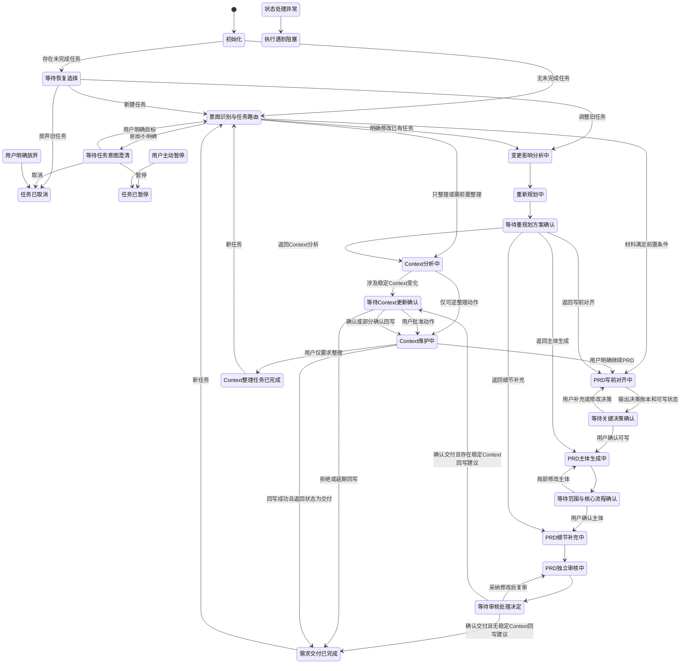

# Context 工程与需求交付协作 Agent

## Agent 状态机设计

> 版本：v0.2  
> 阶段：个人 POC  
> 更新日期：2026-08-03  
> 上游文档：《用户任务流程设计》v0.2  

---

## 0. 设计目标

状态机属于项目 Runtime 的权威控制层，不属于外部 Agent 宿主。外部 Agent 只能通过 Gateway 提交用户自然语言消息并展示 Runtime 响应，不能直接读取后修改状态、提交目标状态或关闭确认记录。更换外部宿主时，任务仍由同一份 Runtime 状态继续执行。

状态机用于把用户任务流程转化为可校验、可持久化、可恢复的 Agent 执行规则，解决以下问题：

- Agent 当前做到哪一步；
- 当前允许调用哪些能力；
- 什么时候必须等待人工确认；
- 用户输入应该被解释为确认、修改、暂停还是新任务；
- 工具失败或会话中断后从哪里恢复；
- 需求变化后应该返回哪个任务节点；
- 如何阻止 Agent 跳过确认点或非法跨状态执行。

状态机属于 Runtime 内 Harness 的确定性约束层。外部 Agent 或 LLM 可以表达用户意图、建议下一步，但最终状态转移必须经过 `AgentOrchestrator` 和 Harness 的程序化合法性校验。

---

## 1. 状态命名规则

产品文档和用户界面使用中文状态名，本地 Runtime、脚本参数和日志使用稳定的英文枚举。

状态分为四类：

| 类型 | 含义 | 示例 |
|---|---|---|
| 系统状态 | 初始化、意图路由等全局处理 | `INITIALIZING` |
| 执行状态 | Agent 或 Skill 正在执行任务 | `CONTEXT_ANALYZING` |
| 等待状态 | 必须等待用户选择或确认 | `WAITING_SCOPE_CONFIRM` |
| 结束/阻塞状态 | 完成、暂停、取消或阻塞 | `DELIVERED` |

---

## 2. 状态总表

| 中文状态 | 英文枚举 | 类型 | 核心含义 |
|---|---|---|---|
| 初始化 | `INITIALIZING` | 系统 | 创建或读取用户、项目、任务和会话信息 |
| 等待恢复选择 | `WAITING_RESUME_CHOICE` | 等待 | 检测到未完成任务，等待继续、调整、放弃或新建 |
| 意图识别与任务路由 | `INTENT_ROUTING` | 系统 | 判断只整理、准备 PRD、修改需求或需要澄清 |
| 等待任务意图澄清 | `WAITING_INTENT_CLARIFICATION` | 等待 | 用户目标不明确，等待选择任务类型 |
| Context 分析中 | `CONTEXT_ANALYZING` | 执行 | 接入材料、检索历史信息、分类并检查冲突 |
| 等待 Context 更新确认 | `WAITING_CONTEXT_CONFIRM` | 等待 | 稳定 Context 将发生变化，等待用户批准 |
| Context 维护中 | `CONTEXT_MAINTAINING` | 执行 | 执行获批写入、替代、归档和索引更新 |
| Context 整理任务已完成 | `CONTEXT_TASK_COMPLETED` | 结束 | 本次 Context 任务结束，不默认进入 PRD |
| PRD 写前对齐中 | `PRD_THINKING` | 执行 | 生成背景理解卡、决策账本和可写状态 |
| 等待关键决策确认 | `WAITING_DECISION_CONFIRM` | 等待 | 等待用户确认目标、范围、关键决策和可写状态 |
| PRD 主体生成中 | `PRD_DRAFTING_CORE` | 执行 | 生成背景、目标、范围、流程和核心功能 |
| 等待范围与核心流程确认 | `WAITING_SCOPE_CONFIRM` | 等待 | 等待用户确认 PRD 主体 |
| PRD 细节补充中 | `PRD_DRAFTING_DETAILS` | 执行 | 补充规则、异常、验收、依赖和风险 |
| PRD 独立审核中 | `PRD_REVIEWING` | 执行 | 独立检查事实、范围、完整性和一致性 |
| 等待审核处理决定 | `WAITING_REVIEW_DECISION` | 等待 | 等待用户决定采纳、拒绝、重规划或交付 |
| 需求交付已完成 | `DELIVERED` | 结束 | 最终 PRD 和相关过程产物已确认并保存 |
| 变更影响分析中 | `CHANGE_ANALYZING` | 执行 | 保存快照并识别受影响与不受影响内容 |
| 重新规划中 | `REPLANNING` | 执行 | 生成返回节点和新的执行计划 |
| 等待重规划方案确认 | `WAITING_REPLAN_CONFIRM` | 等待 | 等待用户确认、调整或取消新计划 |
| 任务已暂停 | `TASK_PAUSED` | 阻塞 | 用户主动暂停，任务可恢复 |
| 执行遇到阻塞 | `EXECUTION_BLOCKED` | 阻塞 | 工具、数据或状态问题导致无法继续，可恢复 |
| 任务已取消 | `TASK_CANCELLED` | 结束 | 用户明确放弃任务，历史记录保留 |

---

## 3. 总体状态图

全局暂停、取消、阻塞和重规划转移在状态转移规则中定义，不在主图中重复绘制。

---

## 4. 状态详细定义

### 4.1 初始化 `INITIALIZING`

进入条件：

- 用户开始新会话；
- 用户从已完成任务发起新任务。

允许动作：

- 读取用户和项目；
- 查询未完成任务；
- 创建新会话；
- 生成或复用任务 ID。

必须保存：

- `user_id`；
- `project_id`；
- `session_id`；
- `task_id`；
- `previous_task_id`（如有）。

合法下一状态：

- `WAITING_RESUME_CHOICE`；
- `INTENT_ROUTING`；
- `EXECUTION_BLOCKED`。

### 4.2 等待恢复选择 `WAITING_RESUME_CHOICE`

进入条件：检测到当前用户和项目存在未完成任务。

展示内容：

- 上次任务目标；
- 当前状态；
- 已完成步骤；
- 待确认事项；
- 最近更新时间；
- 推荐下一步。

用户允许动作：

- 继续；
- 调整；
- 放弃；
- 新建任务。

合法下一状态：

- 恢复前一任务状态；
- `CHANGE_ANALYZING`；
- `TASK_CANCELLED`；
- `INTENT_ROUTING`。

必须创建确认记录：`confirmation_type = RESUME_CHOICE`，并将记录引用写入 `runtime/pending-confirmations.json`。

### 4.3 意图识别与任务路由 `INTENT_ROUTING`

进入条件：新任务开始或用户明确新目标。

允许动作：

- 识别用户目标；
- 判断是否只整理 Context；
- 判断是否准备 PRD；
- 判断是否修改已有任务；
- 判断材料是否需要前置整理。

必须输出并记录：

- `detected_intent`；
- `confidence`；
- `route_target`；
- `route_reason`；
- `required_preconditions`；
- `missing_inputs`。

合法下一状态：

- `WAITING_INTENT_CLARIFICATION`；
- `CONTEXT_ANALYZING`；
- `PRD_THINKING`；
- `CHANGE_ANALYZING`；
- `EXECUTION_BLOCKED`。

### 4.4 等待任务意图澄清 `WAITING_INTENT_CLARIFICATION`

进入条件：无法区分只整理、准备 PRD、修改任务或新任务。

必须创建确认记录：`confirmation_type = INTENT_CLARIFICATION`，并将记录引用写入 `runtime/pending-confirmations.json`。

允许动作：只询问任务目标，不得执行材料写入或 PRD 生成。用户可选择只整理 Context、准备 PRD、修改已有任务或新建任务，也可以暂停或取消。

合法下一状态：

- `INTENT_ROUTING`；
- `TASK_PAUSED`；
- `TASK_CANCELLED`。

### 4.5 Context 分析中 `CONTEXT_ANALYZING`

进入条件：

- 用户要求整理材料；
- PRD 前置检查发现需要先整理；
- 变更涉及事实、来源或稳定 Context。

允许动作：

- 材料登记；
- 写入 `drafts/`；
- 检索 `workspace/` 和 `context/`；
- 信息分类；
- 冲突、重复、过期和索引检查；
- 生成 Context 更新建议。

禁止动作：

- 未确认提升稳定 Context；
- 覆盖已确认事实；
- 生成完整 PRD。

合法下一状态：

- `WAITING_CONTEXT_CONFIRM`；
- `CONTEXT_MAINTAINING`；
- `WAITING_INTENT_CLARIFICATION`；
- `CHANGE_ANALYZING`；
- `EXECUTION_BLOCKED`。

### 4.6 等待 Context 更新确认 `WAITING_CONTEXT_CONFIRM`

进入条件：更新建议涉及稳定 Context 的提升、覆盖、失效、删除或归档。

必须保存：

- 更新建议列表；
- 每条建议的证据；
- 原值和建议值；
- 影响范围；
- 调用方状态；
- 执行后的返回状态。

用户允许动作：

- 全部确认；
- 部分确认；
- 修改建议；
- 延期；
- 放弃更新。

合法下一状态：

- `CONTEXT_MAINTAINING`；
- `CONTEXT_ANALYZING`；
- `DELIVERED`（来源为 `WAITING_REVIEW_DECISION`，且用户拒绝或延期回写）；
- 调用方指定的返回状态（仅适用于其他已登记来源）；
- `TASK_PAUSED`；
- `TASK_CANCELLED`。

守卫条件：

- 若来源为 `WAITING_REVIEW_DECISION`，必须存在 CP-P03 已完成记录，且用户已经确认交付；
- 用户批准 Context 回写时，必须先执行 `CONTEXT_MAINTAINING` 的受控写入，成功后再进入 `DELIVERED`；
- 用户拒绝或延期回写时，不执行稳定 Context 写入，保存原因后进入 `DELIVERED`。

### 4.7 Context 维护中 `CONTEXT_MAINTAINING`

进入条件：

- 只有可逆整理动作；
- 用户已经批准稳定 Context 变更。

允许动作：

- 写入获批内容；
- 更新状态和层级；
- 建立替代与归档关系；
- 更新索引和引用；
- 执行健康检查；
- 保存版本和变更日志。

合法下一状态：

- `CONTEXT_TASK_COMPLETED`；
- `PRD_THINKING`；
- `DELIVERED`（仅来源为 `WAITING_REVIEW_DECISION` 的 PRD 交付后回写）；
- `CONTEXT_ANALYZING`（仅来源为已登记的 Context 前置分析任务）；
- `EXECUTION_BLOCKED`。

返回状态白名单：

| `source_state` | 允许的 `return_state` | 使用条件 |
|---|---|---|
| `CONTEXT_ANALYZING` | `CONTEXT_TASK_COMPLETED`、`PRD_THINKING` | 只整理结束，或用户明确继续准备 PRD |
| `WAITING_REVIEW_DECISION` | `DELIVERED` | 用户已确认 PRD 交付，Context 回写完成、拒绝或延期 |
| 其他已登记调用方 | `CONTEXT_ANALYZING` | 仅允许由状态机配置显式登记，不接受自由传值 |

`PRD_DRAFTING_CORE`、`PRD_DRAFTING_DETAILS`、`PRD_REVIEWING` 等 PRD 执行状态不得作为 CP-C01 的返回状态。若 Context 变化可能影响 PRD，必须返回 `PRD_THINKING` 或进入 `CHANGE_ANALYZING`，重新经过需求判断。

### 4.8 Context 整理任务已完成 `CONTEXT_TASK_COMPLETED`

进入条件：Context 任务完成条件全部满足。

允许动作：

- 展示任务摘要；
- 用户明确要求继续准备 PRD；
- 创建新任务。

禁止动作：自动进入 PRD。

合法下一状态：

- `PRD_THINKING`；
- `INTENT_ROUTING`；
- `INITIALIZING`。

终态处理：进入本状态前，必须完成 Context 文件写入、版本 frontmatter、索引更新和变更事件记录。本状态只允许读取、展示摘要、接受“继续 PRD”或创建新任务，不再调用 `create-version.ts` 或 `update-index.ts`。

### 4.9 PRD 写前对齐中 `PRD_THINKING`

进入条件：

- 用户明确要求准备 PRD；
- 最低前置材料存在；
- 或重规划要求重新完成写前对齐。

允许动作：

- 检索相关 Context 和历史 PRD；
- 生成背景理解卡；
- 识别缺口和冲突；
- 生成决策账本；
- 判断可写状态；
- 提出最多 3 个阻塞问题。

合法下一状态：

- `WAITING_DECISION_CONFIRM`；
- `CONTEXT_ANALYZING`；
- `CHANGE_ANALYZING`；
- `EXECUTION_BLOCKED`。

### 4.10 等待关键决策确认 `WAITING_DECISION_CONFIRM`

进入条件：写前对齐完成，或材料不足需要用户补充。

用户允许动作：

- 确认可写；
- 修改决策；
- 补充材料；
- 暂停；
- 放弃。

合法下一状态：

- `PRD_DRAFTING_CORE`；
- `PRD_THINKING`；
- `CONTEXT_ANALYZING`；
- `CHANGE_ANALYZING`；
- `TASK_PAUSED`；
- `TASK_CANCELLED`。

准入约束：未达到可写状态时，禁止转到 `PRD_DRAFTING_CORE`。

### 4.11 PRD 主体生成中 `PRD_DRAFTING_CORE`

进入条件：

- 可写状态通过；
- 用户确认关键决策；
- 或局部修改主体。

允许动作：生成并保存 PRD 主体版本。

合法下一状态：

- `WAITING_SCOPE_CONFIRM`；
- `EXECUTION_BLOCKED`。

### 4.12 等待范围与核心流程确认 `WAITING_SCOPE_CONFIRM`

进入条件：PRD 主体生成完成。

用户允许动作：

- 确认；
- 局部修改；
- 改变目标、范围或核心流程；
- 暂停；
- 放弃。

合法下一状态：

- `PRD_DRAFTING_DETAILS`；
- `PRD_DRAFTING_CORE`；
- `CHANGE_ANALYZING`；
- `TASK_PAUSED`；
- `TASK_CANCELLED`。

### 4.13 PRD 细节补充中 `PRD_DRAFTING_DETAILS`

进入条件：PRD 主体已确认，或重规划只影响细节层。

允许动作：

- 补充规则、异常、空态、验收、依赖和风险；
- 保存新的 PRD 版本；
- 标记未确认数据。

合法下一状态：

- `PRD_REVIEWING`；
- `CHANGE_ANALYZING`；
- `EXECUTION_BLOCKED`。

### 4.14 PRD 独立审核中 `PRD_REVIEWING`

进入条件：PRD 细节完成，或用户采纳修改后需要复审。

允许动作：

- 独立检索必要 Context；
- 执行审核清单；
- 输出 P0/P1/P2 问题；
- 保存审核版本。

合法下一状态：

- `WAITING_REVIEW_DECISION`；
- `EXECUTION_BLOCKED`。

### 4.15 等待审核处理决定 `WAITING_REVIEW_DECISION`

进入条件：独立审核完成。

用户允许动作：

- 采纳全部或部分建议；
- 拒绝建议并记录理由；
- 因方向问题进入重规划；
- 确认交付；
- 暂停或放弃。

合法下一状态：

- `PRD_DRAFTING_DETAILS`；
- `PRD_REVIEWING`；
- `CHANGE_ANALYZING`；
- `DELIVERED`；
- `TASK_PAUSED`；
- `TASK_CANCELLED`。

条件分支：

- 用户确认交付且最终 PRD 不产生稳定 Context 回写建议：进入 `DELIVERED`；
- 用户确认交付且存在稳定 Context 回写建议：创建 `CONTEXT_UPDATE` 确认记录，进入 `WAITING_CONTEXT_CONFIRM`；
- `WAITING_CONTEXT_CONFIRM` 的 `source_state` 必须为 `WAITING_REVIEW_DECISION`，`return_state` 必须为 `DELIVERED`；
- 审核建议本身不会自动触发 Context 更新确认。

### 4.16 需求交付已完成 `DELIVERED`

进入条件：

- 审核问题已有处理结论；
- 用户确认最终版本；
- 产物、决策和版本已保存；
- Context 回写建议已处理或明确延期。

终态处理：进入本状态前，必须完成最终 PRD、决策账本、审核报告和必要的 Context 回写；`create-version.ts`、`update-index.ts` 和 `log-event.ts` 均在进入本状态前完成。本状态只允许读取、展示交付摘要或创建新任务，不再修改原任务产物。

合法下一状态：

- `INITIALIZING`；
- `INTENT_ROUTING`。

### 4.17 变更影响分析中 `CHANGE_ANALYZING`

进入条件：检测到事实、目标、范围、决策、流程、规则或验收发生变化。

允许动作：

- 保存当前状态和版本快照；
- 识别变更类型；
- 分析受影响和不受影响内容；
- 推荐返回节点。

合法下一状态：

- `REPLANNING`；
- `WAITING_INTENT_CLARIFICATION`；
- `EXECUTION_BLOCKED`。

### 4.18 重新规划中 `REPLANNING`

进入条件：影响分析完成。

允许动作：

- 生成新目标解释；
- 生成返回节点；
- 生成步骤、依赖、确认点和保留内容；
- 评估是否超过 POC 能力边界。

合法下一状态：

- `WAITING_REPLAN_CONFIRM`；
- `EXECUTION_BLOCKED`。

### 4.19 等待重规划方案确认 `WAITING_REPLAN_CONFIRM`

进入条件：新计划生成完成。

用户允许动作：

- 确认；
- 修改计划；
- 取消变更并恢复快照；
- 暂停；
- 放弃原任务并新建任务。

合法下一状态：

- `REPLANNING`（用户要求修改计划）；
- `CONTEXT_ANALYZING`；
- `PRD_THINKING`；
- `PRD_DRAFTING_CORE`；
- `PRD_DRAFTING_DETAILS`；
- 变更前状态；
- `TASK_PAUSED`；
- `TASK_CANCELLED`。

返回业务节点前必须先执行 `apply-replan.ts`；状态中的 `plan_version`、`return_state` 和 `replan_count` 与 CP-R01 不一致时拒绝转移。取消变更时必须先执行 `restore-change-snapshot.ts`，全部业务产物与快照 hash 一致后才能返回变更前状态。

### 4.20 任务已暂停 `TASK_PAUSED`

进入条件：用户主动暂停，或需要等待暂时无法获得的人工信息。

要求：完整保存当前任务快照和推荐恢复节点。

合法下一状态：

- 暂停前状态；
- `CHANGE_ANALYZING`；
- `TASK_CANCELLED`。

### 4.21 执行遇到阻塞 `EXECUTION_BLOCKED`

进入条件：

- 工具重试达到上限；
- 必要数据无法读取；
- 状态数据不完整；
- 发现无法自动恢复的一致性问题。

要求：保存错误类型、失败步骤、已重试次数、可恢复建议和最近有效状态。

合法下一状态：

- 最近有效状态；
- `TASK_PAUSED`；
- `TASK_CANCELLED`。

### 4.22 任务已取消 `TASK_CANCELLED`

进入条件：用户明确放弃当前任务。

要求：保留历史材料、决策、版本和取消原因，不删除已生成产物。

POC 边界：取消只关闭当前任务并写入取消事件，不删除文件、不回滚 Git、不撤销已经执行的 Context 写入。若用户要继续，应创建新任务；已取消任务本身不得直接恢复。

合法下一状态：

- `INITIALIZING`；
- `INTENT_ROUTING`。

---

## 5. 状态转移守卫规则

### 5.1 全局规则

1. 每次处理用户新输入前必须读取当前状态。
2. LLM 只能返回建议下一状态和理由，不能直接修改 `runtime/task-state.json`。
3. `scripts/transition-state.ts` 根据合法转移表、前置条件和人工确认结果决定是否允许转移。
4. 状态转移成功后才能调用下一状态对应的业务能力。
5. 每次状态转移必须记录旧状态、新状态、触发事件、理由、时间和操作者。
6. 等待状态不得自动超时视为用户确认。
7. 结束状态不得继续修改原任务；需要修改时新建变更任务或显式重新打开。
8. 任何 `WAITING_*` 状态都必须存在一个 `PENDING` 的确认记录，且 `confirmation_type` 必须与当前状态的固定映射一致；确认记录缺失或类型不匹配时，状态转移脚本必须拒绝继续执行。

### 5.2 PRD 准入守卫

从 `WAITING_DECISION_CONFIRM` 转到 `PRD_DRAFTING_CORE` 必须满足：

- `writable_status = true`；
- 目标已确认；
- 本期范围与非范围已确认；
- 阻塞性决策均有人工结论；
- 用户明确执行“确认进入主体生成”。

### 5.3 Context 写入守卫

从 `WAITING_CONTEXT_CONFIRM` 转到 `CONTEXT_MAINTAINING` 必须满足：

- 每条高风险变更有明确批准或拒绝状态；
- 执行动作只能包含获批项；
- 原内容版本已生成快照；
- 目标层级、目标文件和来源证据完整。

### 5.4 重规划守卫

从 `WAITING_REPLAN_CONFIRM` 返回业务节点必须满足：

- 用户明确确认新计划；
- 返回节点合法；
- 新决策已保存；
- 保留内容和废弃内容已标记；
- `replan_count < 3`。

其中 PRD 返回节点还必须记录 `approved_prd_base_version`，且该版本与快照一致。CP-R01 只授权按影响报告修订，不替代修订后的 PRD 审核与 CP-P03。

### 5.5 全局变更规则

以下状态允许因实质变化进入 `CHANGE_ANALYZING`：

- `CONTEXT_ANALYZING`；
- `WAITING_CONTEXT_CONFIRM`；
- `PRD_THINKING`；
- `WAITING_DECISION_CONFIRM`；
- `WAITING_SCOPE_CONFIRM`；
- `PRD_DRAFTING_DETAILS`；
- `WAITING_REVIEW_DECISION`；
- `TASK_PAUSED`。

执行状态正在调用工具时，先等待当前工具返回或标记取消，再进入变更分析，避免并发写入同一产物。

---

## 6. 状态持久化要求

POC 使用本地文件保存运行状态：

- `runtime/task-state.json`：当前任务唯一快照，状态成功转移后原子覆盖；
- `runtime/pending-confirmations.json`：当前未完成确认记录，等待状态必须能在此找到对应记录；
- `runtime/task-events.jsonl`：追加写事件流，不允许修改或删除历史行；
- `context-workspace/`：保存任务引用的材料、Context、决策账本、PRD 和报告文件。

Runtime 是任务恢复的即时事实源，Git 是内容和代码的版本历史。两者职责不同，恢复任务时不得仅依赖 Git commit 推断当前状态。

Context 路径按项目隔离：通用项目使用 `context-workspace/projects/<project_id>/context/`，帮助中心搜索演示案例为兼容既有评测使用 `context-workspace/context/`。状态机只认当前任务 `project_id` 对应的 Context 索引和版本。

每个任务至少保存以下字段：

| 字段 | 说明 |
|---|---|
| `task_id` | 任务唯一标识 |
| `project_id` | 所属项目 |
| `session_id` | 当前会话 |
| `task_mode` | Context、PRD 或 Change |
| `current_state` | 当前英文状态枚举 |
| `previous_state` | 上一状态 |
| `return_state` | Context 确认或重规划后的返回状态 |
| `task_goal` | 当前任务目标 |
| `completed_steps` | 已完成步骤 |
| `pending_confirmation` | 当前待确认内容 |
| `material_version` | 当前材料版本 |
| `context_version` | 当前 Context 版本 |
| `decision_ledger_version` | 决策账本版本 |
| `prd_version` | PRD 版本 |
| `plan_version` | 执行计划版本 |
| `latest_output_ref` | 最近产物引用 |
| `retry_count` | 当前步骤重试次数 |
| `replan_count` | 当前任务重规划次数 |
| `error_info` | 最近错误信息 |
| `git_commit` | 最近一次有意义 checkpoint 的提交哈希，可为空 |
| `prompt_versions` | 本次任务使用的 Prompt 版本映射 |
| `skill_versions` | 本次任务使用的 Skill 版本映射 |
| `created_at` / `updated_at` | 创建和更新时间 |

状态历史追加保存到 `runtime/task-events.jsonl`，不用当前记录覆盖历史。状态快照写入应采用临时文件加原子替换，避免中断后产生半写入 JSON。

---

## 7. 重试、恢复与幂等要求

### 7.1 重试

- 单个工具最多自动重试 2 次；
- 重试不得重复创建材料、Context 或 PRD 版本；
- 每次重试使用相同的业务幂等键；
- 达到上限后进入 `EXECUTION_BLOCKED`。

### 7.2 恢复

- 恢复时从最近一个已成功保存的状态开始；
- 等待状态恢复后仍然等待同一确认，不得假设用户已经批准；
- 执行状态中断时先检查工具调用是否已经产生有效结果；
- 有有效结果则进入下一状态，无有效结果才重新调用。

### 7.3 版本

- Context 高风险变更前创建版本快照；
- PRD 主体确认、细节完成、审核修改和最终交付分别形成版本；
- 重规划前创建任务快照；
- 取消变更时恢复快照，但保留取消记录。
- Prompt、Skill 和文档在文件 frontmatter 中维护语义版本；
- 文件路径保持稳定，不通过复制 `v1`、`v2`、`final` 文件制造版本；
- 有意义的里程碑创建 Git checkpoint commit，发布演示版本时可打 Git tag；
- 评测结果记录 Git commit、Prompt 版本、Skill 版本、模型和评测集版本。

---

## 8. 状态机评测点

- 新任务是否正确进入意图路由；
- 未完成任务是否触发恢复选择；
- 模糊意图是否进入等待澄清；
- 未经确认是否禁止写入稳定 Context；
- 未达到可写状态是否禁止生成 PRD 主体；
- 主体未确认是否禁止生成细节；
- 审核未处理是否禁止标记交付；
- 实质变更是否先进入影响分析；
- 重规划是否返回正确节点；
- 工具失败达到上限是否进入阻塞状态；
- 暂停和跨会话恢复是否保持原确认状态；
- 每次状态转移是否存在完整日志；
- 非法状态跳转是否被程序化拒绝。

POC 验收要求：状态转移合法率 100%，非法状态转移拦截率 100%。
