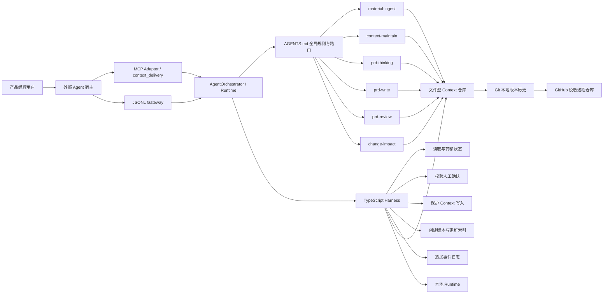

# Context 工程与需求交付协作 Agent

## 项目骨架与技术架构设计

> 版本：v0.3
> 阶段：个人 POC  
> 更新日期：2026-08-05
> 上游文档：《产品定义与 POC 范围》v1.2、《用户任务流程》v0.3、《Agent 状态机》v0.3、《输入输出契约》v0.3

---

## 0. 架构结论

POC 采用以下架构：

> 外部 Agent 是可替换的自然语言交互宿主；MCP Adapter 是主要工具适配层，JSONL Gateway 是兼容和回归适配层；项目 Runtime（`AgentOrchestrator`、状态机、六个 Skill 和 TypeScript Harness）是唯一的业务编排与执行中心；文件型 Context 仓库保存业务材料和交付产物；本地 Runtime 保存即时任务状态；Git/GitHub 负责版本追溯、评测绑定和脱敏作品展示。

本项目不采用三个完全自治的子 Agent，也不把六个 Skill 简化为固定流水线。Runtime 可以根据用户目标、信息成熟度和当前状态选择下一步，但不能绕过 Harness 直接修改状态或稳定 Context。外部 Agent 不拥有业务编排权。

---

## 1. 总体架构



### 1.1 两类运行时事实源

| 内容 | 事实源 | 说明 |
|---|---|---|
| 材料、稳定 Context、决策账本、PRD、审核和影响报告 | `context-workspace/` | 面向业务内容的文件事实源 |
| 当前任务状态、待确认项、执行事件 | `runtime/` | 面向 Agent 执行过程的即时事实源 |

Git 记录内容和代码的历史版本，但不替代 `runtime/`。GitHub 是远程托管和作品展示平台，也不承担任务运行时状态。

---

## 2. 组件职责

### 2.1 外部 Agent 宿主与适配层

外部 Agent 宿主负责自然语言理解、追问、确认收集、调用工具和结果展示，可以被替换。适配层只负责协议校验、内联材料落盘、调用 `AgentOrchestrator.handleMessage()` 和响应包装，不直接执行业务判断、不关闭确认记录。

POC 的主要适配器是 `agent-mcp.ts`，暴露单一 `context_delivery` Tool，支持 MCP `initialize`、`tools/list` 和 `tools/call`。`agent-gateway.ts` 保留 JSONL stdin/stdout，用于协议回归、非 MCP 客户端和故障排查；`agent-cli.ts` 只作为本地参考入口。

适配器必须满足：

- 不复制意图路由、状态转移、确认解析和业务写入逻辑；
- 不接受 `target_state`、`approved_actions` 或直接 Skill 调用参数；
- 将 `materials[].content` 先写入项目 `drafts`，再交给通用 Provider；
- 返回 Runtime 的结构化结果，不把外部 Agent 自己的摘要混入业务产物；
- 工具调用失败时返回错误，不伪造成功响应。

### 2.2 项目 Runtime

POC 的项目 Runtime 运行在本地，不开发独立 WebApp。Runtime 承担：

- 接收用户消息、本地材料路径和内联原始材料；
- 加载仓库根目录的 `AGENTS.md`；
- 由 `AgentOrchestrator` 读取 Context、调用 Skill 和执行受控脚本；
- 展示当前状态、产物摘要和人工确认项；
- 支持同一仓库内的暂停、退出和跨会话恢复。

POC 不把某个模型厂商或桌面产品写成不可替换的业务依赖。只要 Runtime 支持规则文件、文件读写、命令执行和 Skill 调用，即可替换实现。外部宿主是否使用 MCP 不改变 Runtime 的业务边界。

### 2.3 `AGENTS.md`

`AGENTS.md` 是主 Agent 的全局执行入口，至少定义：

- 产品目标和人机边界；
- Context 三层含义、加载顺序和可信度规则；
- 六个 Skill 的用途、触发条件和禁止条件；
- 每次行动前必须读取当前状态；
- 哪些动作必须通过 Harness 脚本执行；
- CP-G01、CP-G02、CP-C01、CP-P01、CP-P02、CP-P03、CP-R01 的确认规则；
- 失败、重试、暂停、恢复和重规划规则；
- 输出中必须保留的来源、版本和追踪字段。

`AGENTS.md` 负责全局规则，不承载某一个 Skill 的详细方法。专业步骤放在各 Skill 的 `SKILL.md` 和 Prompt 中。

### 2.4 `AgentOrchestrator`

Runtime 编排器负责：

- 理解用户当前目标；
- 读取任务状态和相关 Context；
- 判断进入 Context、PRD 或 Change 分支；
- 选择并调用合适的 Skill；
- 根据 Skill 结构化结果建议下一状态；
- 在关键业务判断前暂停并请求人工确认；
- 在用户修改目标或范围时触发影响分析和重规划；
- 向用户解释当前状态、依据、产物和下一步。

Runtime 编排器不负责：

- 直接编辑 `runtime/task-state.json`；
- 未经校验写入或覆盖 `context/`；
- 自行批准人工确认项；
- 在状态转移失败后继续调用下一阶段 Skill；
- 把模型隐藏推理作为业务依据或运行日志。

### 2.5 六个原生 Skill

| Skill | 核心职责 | 主要模式 | 写入权限 |
|---|---|---|---|
| `material-ingest` | 接收、分类、切分和标注材料 | `ANALYZE` | 仅可建议或写入 `drafts/` |
| `context-maintain` | 查重、冲突、生命周期、索引和健康检查 | `ANALYZE`、`APPLY` | `APPLY` 必须通过写入校验脚本 |
| `prd-thinking` | 生成背景理解卡、决策账本和可写状态 | `ANALYZE` | 仅写 `workspace/` 草案 |
| `prd-write` | 生成主体、细节，并按人工审核处置修订 PRD | `CORE`、`DETAILS`、`REVISION` | 仅写 PRD 目标文件，受状态守卫约束 |
| `prd-review` | 独立审核事实、范围、完整性和一致性 | `REVIEW` | 对 PRD 与 Context 只读，只写审核报告 |
| `change-impact` | 分析变化、影响范围和返回节点 | `ANALYZE`、`REPLAN` | 不直接覆盖原产物，只写影响报告和计划草案 |

每个 Skill 目录至少包含：

- `SKILL.md`：用途、触发条件、输入输出和边界；
- `prompt.md`：该能力的核心 Prompt；
- `schema.json`：结构化输出 Schema；
- `references/`：分类、可写性、分阶段、审核和变更路由等确定性规则；
- `examples/`：正例、反例和边界示例。

真实模型 Provider 每次调用前通过 `SkillRuntime` 从磁盘动态加载当前 Skill 的上述全部资源，编译为带 Prompt 版本和内容 SHA-256 的权威指令包。修改 Skill 文件会直接影响下一次模型调用，不需要在 Provider 中同步一份硬编码 Prompt。

所有 Skill 的测试输入、预期输出和回归执行脚本统一放在 `evaluation/`，不在各 Skill 目录中重复维护 `tests/`。

### 2.6 TypeScript Harness

Harness 只实现可程序化验证的控制能力：

| 脚本 | 作用 |
|---|---|
| `get-state.ts` | 读取并校验当前任务状态、待确认项和最近版本 |
| `transition-state.ts` | 根据合法转移表、守卫条件和确认结果修改状态 |
| `manage-confirmation.ts` | 创建、解析和关闭人工确认记录 |
| `validate-context-write.ts` | 校验目标路径、基线版本、来源和 CP-C01 授权 |
| `create-version.ts` | 更新产物 frontmatter 版本、生成快照并返回差异摘要 |
| `update-index.ts` | 根据实际文件更新 Context 索引和替代关系 |
| `log-event.ts` | 向 `task-events.jsonl` 追加结构化事件 |

Harness 不判断需求价值、业务优先级或产品方案。它只回答“当前动作是否被规则允许，以及如何可靠执行和记录”。

### 2.7 文件型 Context 仓库

`context-workspace/` 保存：

- `drafts/`：原始材料和未经确认的信息；
- `workspace/`：当前任务材料、背景卡、决策账本、PRD 草案和报告；
- `context/`：已确认、可复用的稳定业务知识和边界。

POC 的通用项目使用 `context-workspace/context/<project_id>/` 保存独立 Context。项目不保留固定业务案例；所有真实材料只有在 CP-C01 批准后才创建或更新稳定 Context 文件，Context 项目目录和实际使用的分类子目录也在写入时按需创建，不预置空目录，回归夹具只在临时目录使用。

所有稳定 Context 文件至少包含以下 frontmatter：

```yaml
---
id: context-search-boundary
version: 1.1.0
status: active
source_refs:
  - repo://context-workspace/drafts/search-review-notes.md
confirmed_by: user
confirmed_at: 2026-08-03T10:30:00+08:00
supersedes: null
---
```

### 2.8 本地 Runtime 状态

Runtime 初期使用 JSON/JSONL：

| 文件 | 写入方式 | 用途 |
|---|---|---|
| `runtime/task-state.json` | 原子覆盖 | 当前任务唯一快照 |
| `runtime/pending-confirmations.json` | 原子覆盖 | 当前未完成确认项 |
| `runtime/task-events.jsonl` | 只追加 | 状态、Skill、确认、错误和恢复事件 |
| `runtime/provider-output/<task_id>/` | 按任务生成 | Provider 的结构化输出和待校验候选文件 |
| `runtime/provider-output/<item_id>/` | 按候选项生成 | 等待确认或写入的 Context 候选正文 |

Runtime 文件由脚本生成和维护。编排器只能通过 Harness 读取或修改，不直接自由编辑；外部 Agent 宿主无法直接访问这些写入能力。

### 2.8.1 可替换真实模型 Provider

Runtime 将真实模型接入拆成三层：`SkillRuntime` 动态加载并编译 Skill 指令，`OpenAIProvider` 负责 Context、PRD、Change 的业务输入整理和结果映射，`StructuredModelClient` 只负责“Skill 指令 + 阶段性 JSON Schema + 材料 → JSON”的厂商调用。当前内置 `OpenAIResponsesClient`、OpenAI 兼容 Chat Completions 客户端和 `AnthropicMessagesClient`，分别覆盖 OpenAI、DeepSeek/Kimi/其他兼容服务和 Claude。通过 `MODEL_PROVIDER` 选择；未启用时 Runtime 使用本地 `WorkspaceProvider` 完成材料整理和 Context 基线处理，但 PRD 分支必须在写前阻塞。`npm run model:check` 用于检查 Provider、模型 ID、服务地址和密钥是否存在，输出不得包含密钥内容。模型接入只替换生成层，不改变以下控制权：

- 材料路径、Context 目标路径、PRD 稳定路径由 Runtime 计算；
- 模型输出必须先通过现有 Skill 校验器；不支持严格 JSON Schema 的服务也必须返回 JSON，之后由本地校验器做最终判定；
- 稳定 Context、PRD 和重规划仍受人工确认点约束；
- API 失败、超时、无效 JSON 或校验失败均停止执行，不静默回退写入；
- 未配置真实模型时不得生成、审核或交付通用占位 PRD；
- API Key 只从进程环境、`.env` 或 `.env.local` 读取，不写入 Runtime 产物和 Git。

真实模型客户端统一要求结构化 JSON。`schema.json` 是 Skill 的最终业务契约；Provider 会针对当前阶段生成不包含 Runtime 路径、版本和确认结果的响应 Schema，最终产物再由 Harness 按 Skill 契约校验。OpenAI Responses 使用严格 JSON Schema；OpenAI 兼容服务使用 `response_format=json_object` 并在 system 指令中显式提供 Schema；Claude 使用 Messages API 并在请求中传入 Schema。PRD DETAILS 写作与 `prd-review` 是两次独立模型调用，审核调用只读已生成正文。CP-P03 选择 `FIX_AND_REVIEW` 后，REVISION 调用同时接收当前 PRD、当前审核报告和用户修订决定，按当前版本生成独立缓存文件；修订写入同一 PRD 路径并递增补丁版本后，再使用该版本的独立 REVIEW 缓存重新审核。材料整理阶段发送当前任务原始材料；PRD 阶段发送当前项目必要的 Context 和分析产物；变更阶段发送变更请求和受影响业务产物。使用者必须在启用真实模型前判断这些材料是否允许发送给外部模型服务。

新增厂商时遵循四步：实现 `StructuredModelClient`，解析该厂商响应为 JSON；在 Runtime Provider 工厂中增加路由和环境变量；为成功、错误、超时、非法 JSON 增加离线回归；运行完整回归。不要在客户端直接写 Context、PRD 或确认记录，也不要为了兼容某个模型降低本地 Schema 和人工确认门禁。

### 2.9 Git 与 GitHub

Git/GitHub 管理：

- `AGENTS.md`、Prompt、Skill、Schema 和脚本版本；
- 产品文档与架构决策；
- 脱敏后的 Context、通用项目材料和隔离回归证据；
- 测试用例、评测结果、Bad Case 和修复记录；

不提交：

- `.env` 和 API Key；
- `runtime/task-state.json`、`runtime/pending-confirmations.json`、`runtime/task-events.jsonl` 和 `runtime/provider-output/`；
- 未脱敏原始材料和个人敏感信息；
- 模型隐藏推理和无必要的完整对话记录。

---

## 3. 主 Agent 标准处理协议

每次 Gateway 将用户输入交给 Runtime 时：

```text
1. 通过 get-state.ts 读取当前状态和待确认项
2. 按 AGENTS.md 规则加载最小必要 Context
3. 在当前状态下解释用户输入
4. 选择一个业务 Skill 或进入人工确认处理
5. 校验 Skill 的结构化输出和来源引用
6. 调用 transition-state.ts 申请状态转移
7. 需要写文件时先调用 validate-context-write.ts
8. 调用 create-version.ts 或 update-index.ts 完成受控写入
9. 调用 log-event.ts 追加执行事件
10. 将结果返回给 Gateway，由外部 Agent 宿主展示当前状态和下一步
```

禁止：

- 未读取状态直接调用业务 Skill；
- 同一轮并行写入同一目标文件；
- 先执行下一阶段，再补记状态；
- 状态转移被拒绝后仍继续；
- 把用户沉默解释为默认批准；
- 为了保存旧版本复制出带 `v1`、`v2`、`final` 后缀的同名文件。

---

## 4. 本地存储模型

### 4.1 `task-state.json`

保存当前任务快照，核心字段与状态机文档一致，包括：

- 任务、项目和会话标识；
- 当前、上一和返回状态；
- 任务目标、模式和完成步骤；
- Context、决策、PRD 和计划版本；
- 最近产物引用、重试和重规划次数；
- 最近 checkpoint commit；
- Prompt 和 Skill 版本映射。

状态变更必须采用“读取基线 → 校验 → 写临时文件 → 原子替换”的方式，避免半写入。

### 4.2 `pending-confirmations.json`

每条确认记录至少包含：

- `confirmation_id`；
- `confirmation_type`；
- `task_id`；
- `current_state`；
- `items` 和允许动作；
- `status`；
- `resolved_by`、`resolved_at` 和 `resolution`。

已完成确认不可原地覆盖历史。确认记录与进入对应等待态由统一 helper 提交；迁移失败时不删除记录，而是将其标记为 `CANCELLED`、`resolved_by = SYSTEM` 并写入事件。每次请求、恢复和重试还会取消未被 `task-state.json.pending_confirmation` 引用的悬空 `PENDING`，保证当前等待态最多只有一个权威确认；`TASK_PAUSED` 会保留暂停前等待态的原确认，恢复后再重新关联，不在暂停期间清理。

### 4.3 `task-events.jsonl`

每一行是独立 JSON 事件，至少支持：

- `STATE_TRANSITION`；
- `SKILL_CALL`；
- `SKILL_RESULT`；
- `USER_CONFIRMATION`；
- `ARTIFACT_CREATED`；
- `VERSION_CREATED`；
- `ERROR`；
- `TASK_PAUSED`；
- `TASK_RESUMED`。

事件必须包含 `request_id`、`idempotency_key`、时间、操作者、状态、Skill/Prompt 版本和相关文件引用。

### 4.4 `provider-output/`

`provider-output/` 保存 Provider 生成、等待 Runtime 校验或后续写入使用的中间文件，常见内容包括：

- `material-ingest.input.json`：本轮材料接入的结构化输入；
- `material-ingest.output.json`：材料分类、来源和信息项结果；
- `context-maintain.analysis.json`：冲突、未决问题和 Context 更新建议；
- `meeting-note.md` 或其他整理稿候选：Runtime 发布业务整理稿前使用的候选正文；
- `<item_id>/context-candidate.md`：CP-C01 批准后可能写入稳定 Context 的候选正文。
- `openai-prd-revision-<version>.json`、`openai-prd-review-<version>.json`：审核后按用户决定生成的版本化修订和复审缓存，不与初次 DETAILS/REVIEW 共用。

这些文件是执行中间态，不是最终业务事实。可阅读整理稿、PRD、已批准 Context 等正式产物必须以 Runtime 返回的 `context-workspace/` artifact 为准。正在等待确认或尚未完成写入时，不得单独删除相关候选文件，否则任务即使仍有状态记录也可能无法继续。

### 4.5 Runtime 文件保留与清理判断

判断 `runtime/` 中的文件是否还有用，先读取 `task-state.json` 的 `current_state`，再核对其中的 `pending_confirmation`、`latest_output_ref` 和实际业务产物。不要仅凭“内容看起来已经确定”删除运行记录；业务内容是否确定，与任务是否完成状态转移是两件事。

| 当前状态或情况 | 是否可清理 | 处理规则 |
|---|---|---|
| `WAITING_*` | 不可直接清理 | 任务正在等待人工确认；先批准、拒绝、暂缓或取消任务 |
| `TASK_PAUSED` | 不可直接清理 | 保留全部 Runtime 文件，供后续恢复 |
| `EXECUTION_BLOCKED` | 原则上保留 | 排查错误并恢复；确定放弃后应先取消任务，再清理 |
| 进行中的分析、PRD 或重规划状态 | 不可清理 | 状态、事件和 Provider 输出都可能是下一步输入 |
| `CONTEXT_TASK_COMPLETED` 或 `DELIVERED` | 可以清理 | 先确认 Runtime 返回的业务 artifact 已存在于 `context-workspace/` |
| `TASK_CANCELLED` | 可以清理 | 确认不再恢复该任务；变更任务还需确认快照恢复已成功 |
| Runtime 文件损坏或相互不一致 | 不要直接清理后继续 | 将任务视为阻塞；根据事件和业务产物恢复，或明确取消并开始新任务 |

清理前按以下顺序检查：

1. `task-state.json` 已进入 `CONTEXT_TASK_COMPLETED`、`DELIVERED` 或已明确放弃的 `TASK_CANCELLED`；
2. `pending-confirmations.json` 不存在 `PENDING` 记录；
3. `latest_output_ref` 以及 Runtime 返回的 artifact 均能在 `context-workspace/` 找到；
4. 需要版本管理的整理稿、PRD 或稳定 Context 已处于正确项目路径；
5. 不再需要用 `task-events.jsonl` 排查失败、证明确认过程或恢复任务。

满足以上条件后，可以删除 `task-state.json`、`pending-confirmations.json`、`task-events.jsonl` 和整个 `provider-output/`。删除 Runtime 记录不会自动删除 `context-workspace/` 中已经发布的业务产物；反过来，Runtime 中存在 Provider 输出也不代表任务已经完成。

当前 POC 是单活跃任务运行时，三份核心状态文件不是按任务分别存储。因此不要只删除其中一份，也不要在旧任务仍处于 `WAITING_*`、暂停或执行中状态时直接开始新任务。需要保留审计证据时，可先将必要的脱敏事件或评测证据复制到 `evaluation/` 对应目录，再清理本地 Runtime；不得将包含真实材料或个人信息的 Runtime 文件提交到 Git。

---

## 5. Context 运行时设计

### 5.1 业务内容事实源

`context-workspace/` 是 POC 的业务内容事实源。Agent 读取和生成的材料、Context、决策和 PRD 都以仓库内文件为准，不再同步维护数据库副本。

### 5.2 三层目录

| 层级 | 默认可信度 | 是否可被 PRD 当作事实 | 写入规则 |
|---|---|---|---|
| `drafts/` | 低 | 否 | 原始材料可自动进入，必须保留来源 |
| `workspace/` | 中，依状态判断 | 仅已确认内容 | 当前任务可写，不自动提升可信级别 |
| `context/` | 高 | 是，但检查有效期和版本 | 高风险变化必须通过 CP-C01 与脚本校验 |

### 5.3 加载顺序

```text
1. runtime 中的当前任务和待确认事项
2. 同主题稳定 context
3. 当前 workspace 材料和决策
4. 历史 PRD 与变更记录
5. drafts 中的原始证据
```

检索结果必须保留路径、层级、状态、版本、来源和 Git commit。主 Agent 应加载完成当前判断所需的最小 Context，避免无差别把全仓库放入模型上下文。

### 5.4 稳定 Context 写入事务

```text
读取当前文件和基线版本
    ↓
校验 CP-C01 确认记录
    ↓
validate-context-write.ts 校验路径、来源和允许动作
    ↓
create-version.ts 创建快照并更新 frontmatter
    ↓
写入目标文件
    ↓
update-index.ts 更新索引和替代关系
    ↓
log-event.ts 追加事件
    ↓
在有意义的里程碑创建 Git checkpoint
```

任一步失败时停止后续步骤，保留原文件，并将失败信息写入事件日志。

---

## 6. 代码与配置目录骨架

```text
context-delivery-agent/
├── README.md
├── AGENTS.md
├── package.json
├── tsconfig.json
├── .env.example
├── .gitignore
├── docs/
│   ├── 01-product-definition.md
│   ├── 02-user-task-flows.md
│   ├── 03-state-machine.md
│   ├── 04-io-contracts.md
│   └── 05-architecture.md
├── prompts/
│   ├── main-agent.md
│   ├── routing-rules.md
│   └── response-format.md
├── skills/
│   ├── material-ingest/
│   │   ├── SKILL.md
│   │   ├── prompt.md
│   │   ├── schema.json
│   │   └── examples/
│   ├── context-maintain/
│   ├── prd-thinking/
│   ├── prd-write/
│   ├── prd-review/
│   └── change-impact/
├── context-workspace/
│   ├── drafts/
│   ├── workspace/
│   │   ├── decisions/                    # CP-P01 确认后的人工决策账本，作为 PRD 生成与校验依据
│   │   ├── prd/                          # Runtime 生成的 PRD 业务交付物，在稳定路径中连续修订
│   │   ├── reports/                      # 材料、Context、PRD 和变更流程的分析与审核报告
│   │   ├── plans/                        # 首次写入时按需创建，保存 change-impact/REPLAN 的待 CP-R01 确认方案
│   │   ├── snapshots/                    # 首次写入时按需创建，保存 CHANGE_ANALYZING 的变更前快照、字节和 SHA-256
│   │   └── projects/
│   │       └── <project_id>/materials/  # Runtime 发布的中可信度可阅读整理稿
│   └── context/
│       └── <project_id>/                 # 稳定 Context，按项目隔离
│           ├── INDEX.md
│           ├── product/
│           ├── users/
│           ├── business-rules/
│           └── glossary/
├── runtime/
│   ├── task-state.json
│   ├── pending-confirmations.json
│   ├── task-events.jsonl
│   └── provider-output/
├── state-machine/
│   ├── states.json
│   ├── transitions.json
│   └── guards.json
├── schemas/
│   ├── common-envelope.schema.json
│   ├── task-state.schema.json
│   ├── confirmation.schema.json
│   ├── task-event.schema.json
│   └── evaluation-result.schema.json
├── scripts/
│   ├── agent/
│   │   ├── orchestrator.ts
│   │   ├── skill-runtime.ts             # 动态加载并编译 Skill 权威指令包
│   │   ├── types.ts
│   │   └── workspace-provider.ts
│   ├── agent-cli.ts                  # 参考 CLI 适配器
│   ├── agent-gateway.ts              # 通用 JSONL Gateway
│   ├── agent-mcp.ts                  # MCP stdio 适配器，暴露 context_delivery
│   ├── gateway/
│   │   └── types.ts
│   ├── get-state.ts
│   ├── transition-state.ts
│   ├── manage-confirmation.ts
│   ├── validate-context-write.ts
│   ├── create-version.ts
│   ├── update-index.ts
│   └── log-event.ts
├── evaluation/
│   ├── eval-set.yaml
│   ├── fixtures/                    # 各 Skill 统一使用的测试输入和预期输出
│   ├── run-*.ts                    # Context、PRD、Change、Agent 等集中回归执行器
│   ├── rubrics/
│   ├── execution-logs/
│   ├── results/
│   └── bad-cases/
```

`runtime/*.json` 和 `runtime/*.jsonl` 是运行时生成文件，应加入 `.gitignore`。仓库中通过 Schema、隔离通用夹具和初始化脚本说明格式，不提交真实会话状态或预置业务案例。

`context-workspace/workspace/snapshots/<change_id>/` 仅在用户修改已确认的 PRD、Context 或其他业务产物并进入 `CHANGE_ANALYZING` 时使用。Runtime 会在变更分析前保存原始字节、文件路径、文件大小、SHA-256 和版本基线，用于校验分析期间文件未被外部修改，并在取消变更时恢复原产物。`snapshots/` 根目录及其变更子目录均由首次实际写入按需创建，普通任务不会预先创建空目录。

`context-workspace/workspace/plans/` 保存 `change-impact/REPLAN` 生成的 `DRAFT` 重规划方案，包括受影响项、保留项、建议返回节点、后续步骤和所需确认点。计划必须引用影响报告与快照，经过 CP-R01 批准后才能应用；普通材料整理和首次 PRD 生成不使用这两个目录。`plans/` 根目录仅在首次实际写入计划时创建，不预置空目录。

---

## 7. 模块调用与状态映射

所有业务调用都由 Runtime 编排器发起。外部 Agent 只能调用 MCP Adapter、JSONL Gateway 或 CLI Adapter，不能直接调用下表的 Skill 或 Harness。

MCP、JSONL 和 CLI 仅是不同接入层，均调用同一个 `AgentOrchestrator`；接入层不产生额外业务状态。内联材料和本地路径材料统一落盘到 `context-workspace/drafts/<project_id>/source-materials/<task_id>/materials.md`，每次任务输入只生成这一个 Markdown 原文包，包内以 `source_id` 边界保留多份原文。之后两类输入共用 `CONTEXT_ANALYZING` 路径；项目级 `material-manifest.json` 同时保存 `ingestions`（每次任务的接入元数据）和 `records`（逐条逻辑来源、哈希与共享 draft 引用），不复制原文。多个记录可以指向同一个 `materials.md`，但分析、证据校验和重复检测必须按各自 `source_id` 读取并计算。旧版本的一文件一材料目录和任务目录中的 `ingest-manifest.json` 仅用于兼容读取，不再由新流程生成。

原文包为每条逻辑材料写入不影响原文提取的定位锚点。结构化整理稿的来源区使用材料名称和中文元数据链接到该锚点，不展示内部哈希 ID。对于 `USER_FEEDBACK`，Runtime 使用确定性记录解析器把用户 ID 与反馈正文合并为一个阅读单元；该规则同时约束 Workspace Provider 和模型 Provider，模型不能覆盖用户可见的反馈与来源格式。

接入层未提供 `task_id` 时，Runtime 会优先继承当前运行任务的 ID，避免把确认消息错误创建成新任务；需要并行开启新任务时必须显式提供新的任务标识。终态任务允许显式提供新 `task_id` 开启新任务。等待意图澄清时，Runtime 先验证新消息是否包含可识别任务意图，不能把任意下一条消息自动标记为确认并吞掉原文。材料内容按 SHA-256 检查跨任务重复；发现相同材料时先进入 `WAITING_MATERIAL_REPROCESS_CONFIRM`，只有用户明确批准才重新整理并覆盖已有整理稿。

| 当前状态 | 允许调用的业务 Skill | 允许调用的 Harness 能力 |
|---|---|---|
| 初始化 | 无 | `get-state`、初始化任务、`log-event` |
| 等待恢复选择 | 无 | `manage-confirmation`、`transition-state`、`log-event` |
| 意图识别与任务路由 | 主 Agent 路由 | 读取摘要、`transition-state` |
| 等待任务意图澄清 | 无 | `manage-confirmation`、`transition-state`、`log-event` |
| 等待重复材料重新整理确认 | 无 | `manage-confirmation`、`transition-state`、`log-event`；批准后重新调用 Context 分析，保留后复用既有整理稿 |
| Context 分析中 | `material-ingest`、`context-maintain/ANALYZE` | 读文件、保存草案、`transition-state` |
| 等待 Context 更新确认 | 无 | `manage-confirmation`、`transition-state` |
| Context 维护中 | `context-maintain/APPLY` | `validate-context-write`、`create-version`、`update-index`、`log-event` |
| Context 整理任务已完成 | 无 | `get-state`、`log-event`、`transition-state`（仅用户明确继续或新建）；终态前已完成 `create-version`、`update-index` |
| PRD 写前对齐中 | `prd-thinking` | 读文件、保存背景卡和决策账本 |
| 等待关键决策确认 | 无 | `manage-confirmation`、`transition-state` |
| PRD 主体生成中 | `prd-write/CORE` | `create-version`、保存 PRD、`log-event` |
| 等待范围与核心流程确认 | 无 | `manage-confirmation`、`transition-state` |
| PRD 细节补充中 | `prd-write/DETAILS`；审核修订时为 `prd-write/REVISION` | `create-version`、保存同一路径 PRD、`log-event` |
| PRD 独立审核中 | `prd-review`；CP-P03 选择先修复后可接收具体修订决定 | 读取只读快照、保存审核报告；明确修订后转入 REVISION |
| 等待审核处理决定 | 无 | `manage-confirmation`、`transition-state` |
| 需求交付已完成 | 无 | `get-state`、`log-event`、`transition-state`（仅新任务）；终态前已完成 `create-version`、`update-index` |
| 变更影响分析中 | `change-impact/ANALYZE` | 创建快照、保存影响报告 |
| 重新规划中 | `change-impact/REPLAN` | 保存新计划、`transition-state` |
| 等待重规划方案确认 | 无 | `manage-confirmation`、恢复快照或返回业务状态 |
| 任务已暂停 | 无 | `get-state`、`manage-confirmation`、`transition-state`、`log-event` |
| 执行遇到阻塞 | 无，除非恢复后重新授权 | `get-state`、`log-event`、`transition-state`、错误恢复检查；不得写业务产物 |
| 任务已取消 | 无 | `get-state`、`log-event`、`transition-state`（仅初始化新任务）；不得删除、回滚或恢复原任务；Context 撤销必须新建任务并经 CP-C01 归档 |

Context 分析阶段除 JSON 分析报告外，Runtime 必须生成一份可阅读的结构化材料整理稿。分析报告保存在被 Git 忽略的 `context-workspace/workspace/agent-runs/<task_id>/`；会议整理稿发布到 `context-workspace/workspace/projects/<project_id>/materials/meeting-notes/<task_id>.md`，其他整理稿发布到同项目的 `materials/structured-materials/<task_id>.md`。整理稿属于中可信度 Runtime artifact，可纳入版本管理，但不得自动提升为稳定 Context。外部 Agent 只能展示 Runtime 返回的引用，不能在根目录另建 `meeting-notes/`。

稳定 Context 的章节级降级沿用 `CONTEXT_ANALYZING → WAITING_CONTEXT_CONFIRM → CONTEXT_MAINTAINING`。Runtime 按 Markdown 标题边界提取用户指定章节，把剩余正文写入 `agent-runs/<task_id>/candidates/`，把移出内容写入 `workspace/projects/<project_id>/context-pending/<task_id>/`，并生成 `UPDATE_CONTEXT` proposal。CP-C01 批准后由 `create-version` 校验基线并递增原文件版本，`update-index` 保持文件 active。派生文件 `INDEX.md` 不得成为撤销或局部更新 proposal 的目标。

共 23 个状态均在此表登记。等待状态统一通过 `manage-confirmation` 创建或处理确认记录；执行状态先调用对应 Skill，再由 `transition-state` 校验下一状态；结束、暂停、阻塞和取消状态不得继续调用业务 Skill。两个业务终态的版本和索引动作必须在入态前完成，不在终态中重复执行。

---

## 8. Git/GitHub 版本管理

### 8.1 版本原则

- Prompt、Skill、Schema 和文档在 frontmatter 中维护语义版本；
- 文件路径保持稳定，旧版本通过 Git history、commit 和 tag 查看；
- 只有有意义的阶段成果创建 checkpoint，不为每次模型调用提交代码；
- Git commit message 说明变更对象和原因，例如 `feat(skill): add conflict classification rules`；


### 8.2 建议 checkpoint

- 产品和架构基线确认；
- 单个 Skill 首次可运行；
- Context 分支端到端通过；
- PRD 分支端到端通过；
- 修改与重规划通过；
- Bad Case 修复完成；

### 8.3 评测绑定

每条评测结果至少记录：

- `git_commit`；
- `prompt_versions`；
- `skill_versions`；
- `schema_versions`；
- `model` 和关键参数；
- `eval_set_version`；
- 测试时间、输入、结构化输出、评分和失败原因。

同一评测集修复前后应使用不同 commit 执行，以证明 Bad Case、修复动作和回归结果之间的关系。

### 8.4 GitHub 展示边界

公开仓库仅保存脱敏工作流说明和可复现测试证据。README 应明确：

- 项目是个人 POC；
- 默认通用项目工作区的使用方式；
- 不代表真实企业部署或业务 ROI；
- 如何初始化 Runtime和执行评测；
- 哪些目录是业务能力、Harness、Context 和评测证据。

---

## 9. 安全与权限边界

POC 至少实现：

- 所有写操作限制在仓库允许目录；
- 主 Agent 不能直接修改 Runtime 状态和稳定 Context；
- 稳定 Context 高风险写入必须校验 CP-C01；
- 状态转移必须经过白名单和守卫条件；
- 所有写入使用幂等键并检查基线版本；
- `prd-review` 对 PRD 和 Context 只读；
- 删除优先改为归档或标记被替代；
- 事件日志不保存密钥和完整隐藏推理；
- `.env`、Runtime 和敏感材料通过 `.gitignore` 隔离；
- 推送 GitHub 前执行脱敏检查。

---

## 10. POC 实施顺序

### 阶段 1：仓库与工作流骨架

- 初始化 Git 仓库和 GitHub 远程仓库；
- 创建目录、`.gitignore`、Schema 和示例；
- 建立通用材料接入、状态机和确认点；
- 建立与业务无关的隔离回归夹具和输出标准。

### 阶段 2：Harness 最小闭环

- 实现 `get-state.ts` 和 Runtime 初始化；
- 实现 `transition-state.ts` 与状态守卫；
- 实现人工确认和事件追加写；
- 实现 `TASK_PAUSED`、`EXECUTION_BLOCKED`、`TASK_CANCELLED` 三个轻量控制状态；
- 验证非法状态转移、未确认写入、跨会话恢复和取消后禁止恢复。

### 阶段 3：Context 分支

- 实现 `material-ingest`；
- 实现 `context-maintain` 的 `ANALYZE` 与 `APPLY`；
- 实现写入校验、版本和索引脚本；
- 跑通“只整理资料后结束”。
- 验证“只整理资料”也必须经过 Runtime，且结构化整理稿、原文登记和分析报告都位于 `context-workspace/`。
- 验证进入 `CONTEXT_TASK_COMPLETED` 前已完成版本、索引和事件记录，终态不重复写入。

### 阶段 4：PRD 分支

- 实现 `prd-thinking`；
- 实现 `prd-write` 的 `CORE` 与 `DETAILS`；
- 实现审核后的 `prd-write/REVISION`，连续递增补丁版本并重新审核；
- 实现独立 `prd-review`；
- 跑通 CP-P01、CP-P02 和 CP-P03。
- 验证进入 `DELIVERED` 前已完成最终版本、索引和事件记录，终态不重复写入。

### 阶段 5：修改与重规划

- 实现 `change-impact`；
- 完成影响报告、保留项和返回节点；
- 跑通 CP-R01；
- 验证局部更新与原版本恢复。

实现脚本包括 `create-change-snapshot.ts`、`record-change-analysis.ts`、`record-replan.ts`、`apply-replan.ts` 和 `restore-change-snapshot.ts`。影响分析和计划草案只写 workspace；业务产物更新由返回节点对应 Skill 执行。

### 阶段 6：评测与作品整理

- 执行 10 至 12 个测试用例；
- 将结果绑定到 commit、Prompt、Skill、Schema、模型和评测集版本；
- 完成 Bad Case 归因、修复和回归；
- 发布脱敏 GitHub 仓库。

### 阶段 7：External Agent 适配层

- 定义外部 Agent 请求/响应契约和内联材料契约；
- 实现 MCP stdio Adapter 和 `context_delivery` Tool；
- 保留 JSONL Gateway，验证 MCP、Gateway 与参考 CLI 复用同一个 Runtime 编排结果；
- 验证会议原文经 Tool 调用后进入 `drafts`，`material-ingest` 被执行并在 CP-C01 停止；
- 验证确认原文复用同一 `task_id` 后才发生 Context 写入；
- 验证更换外部宿主不改变状态、确认门禁和产物写入；
- 验证 Runtime 等待或阻塞时外部宿主不得生成替代产物或报告完成；完成时必须返回 `context-workspace/` 内 artifact；
- 后续接入 HTTP 或 IDE 时仅新增适配器，不复制业务编排。

---

## 11. 项目骨架验收标准

- `AGENTS.md`、六个 Skill、Harness、Context、Runtime 和评测目录边界清楚；
- 六个 Skill 与全局状态控制职责分离；
- `context-workspace/` 是业务内容事实源，`runtime/` 是即时执行事实源；
- 主 Agent没有直接改状态和稳定 Context 的权限；
- `transition-state.ts` 能程序化拒绝非法转移；
- `validate-context-write.ts` 能阻止未经确认或基线冲突的稳定写入；
- Runtime 支持暂停和跨会话恢复，事件历史采用 JSONL 追加写；
- 所有核心 Skill 有结构化输入输出 Schema 和最小测试；
- 案例标准答案与系统实际输出分开保存；
- Prompt、Skill、Schema 和文档采用稳定路径与语义版本；
- 评测日志可追溯到 Git commit、模型、版本、输入和结果；
- GitHub 仓库不包含密钥、Runtime 状态和未脱敏材料；
- 外部 Agent 可通过 MCP 以自然语言完成至少一条“材料整理 → 人工确认 → Context 结果”闭环；
- MCP Adapter 不包含业务编排分支，所有业务结果都能在 Runtime 事件和产物中追溯。
