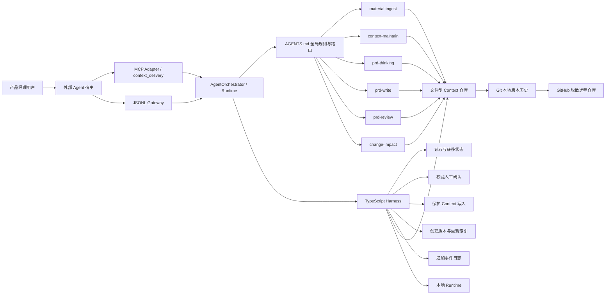

# Context 工程与需求交付协作 Agent

## 项目骨架与技术架构设计

> 版本：v0.3
> 阶段：个人 POC  
> 更新日期：2026-08-05
> 上游文档：《产品定义与 POC 范围》v1.2、《用户任务流程》v0.3、《Agent 状态机》v0.3、《输入输出契约》v0.3

---

## 0. 架构结论

POC 采用以下架构：

> 外部 Agent 是可替换的自然语言交互宿主；MCP Adapter 是主要工具适配层，JSONL Gateway 是兼容和回归适配层；项目 Runtime（`AgentOrchestrator`、状态机、六个 Skill 和 TypeScript Harness）是唯一的业务编排与执行中心；文件型 Context 仓库保存业务材料和交付产物；本地 Runtime 保存即时任务状态；Git/GitHub 负责版本追溯、评测绑定和脱敏作品展示。

本项目不采用三个完全自治的子 Agent，也不把六个 Skill 简化为固定流水线。Runtime 可以根据用户目标、信息成熟度和当前状态选择下一步，但不能绕过 Harness 直接修改状态或稳定 Context。外部 Agent 不拥有业务编排权。

---

## 1. 总体架构



### 1.1 两类运行时事实源

| 内容 | 事实源 | 说明 |
|---|---|---|
| 材料、稳定 Context、决策账本、PRD、审核和影响报告 | `context-workspace/` | 面向业务内容的文件事实源 |
| 当前任务状态、待确认项、执行事件 | `runtime/` | 面向 Agent 执行过程的即时事实源 |

Git 记录内容和代码的历史版本，但不替代 `runtime/`。GitHub 是远程托管和作品展示平台，也不承担任务运行时状态。

---

## 2. 组件职责

### 2.1 外部 Agent 宿主与适配层

外部 Agent 宿主负责自然语言理解、追问、确认收集、调用工具和结果展示，可以被替换。适配层只负责协议校验、内联材料落盘、调用 `AgentOrchestrator.handleMessage()` 和响应包装，不直接执行业务判断、不关闭确认记录。

POC 的主要适配器是 `agent-mcp.ts`，暴露单一 `context_delivery` Tool，支持 MCP `initialize`、`tools/list` 和 `tools/call`。`agent-gateway.ts` 保留 JSONL stdin/stdout，用于协议回归、非 MCP 客户端和故障排查；`agent-cli.ts` 只作为本地参考入口。

适配器必须满足：

- 不复制意图路由、状态转移、确认解析和业务写入逻辑；
- 不接受 `target_state`、`approved_actions` 或直接 Skill 调用参数；
- 将 `materials[].content` 先写入项目 `drafts`，再交给通用 Provider；
- 返回 Runtime 的结构化结果，不把外部 Agent 自己的摘要混入业务产物；
- 工具调用失败时返回错误，不伪造成功响应。

### 2.2 项目 Runtime

POC 的项目 Runtime 运行在本地，不开发独立 WebApp。Runtime 承担：

- 接收用户消息、本地材料路径和内联原始材料；
- 加载仓库根目录的 `AGENTS.md`；
- 由 `AgentOrchestrator` 读取 Context、调用 Skill 和执行受控脚本；
- 展示当前状态、产物摘要和人工确认项；
- 支持同一仓库内的暂停、退出和跨会话恢复。

POC 不把某个模型厂商或桌面产品写成不可替换的业务依赖。只要 Runtime 支持规则文件、文件读写、命令执行和 Skill 调用，即可替换实现。外部宿主是否使用 MCP 不改变 Runtime 的业务边界。

### 2.3 `AGENTS.md`

`AGENTS.md` 是主 Agent 的全局执行入口，至少定义：

- 产品目标和人机边界；
- Context 三层含义、加载顺序和可信度规则；
- 六个 Skill 的用途、触发条件和禁止条件；
- 每次行动前必须读取当前状态；
- 哪些动作必须通过 Harness 脚本执行；
- CP-G01、CP-G02、CP-C01、CP-P01、CP-P02、CP-P03、CP-R01 的确认规则；
- 失败、重试、暂停、恢复和重规划规则；
- 输出中必须保留的来源、版本和追踪字段。

`AGENTS.md` 负责全局规则，不承载某一个 Skill 的详细方法。专业步骤放在各 Skill 的 `SKILL.md` 和 Prompt 中。

### 2.4 `AgentOrchestrator`

Runtime 编排器负责：

- 理解用户当前目标；
- 读取任务状态和相关 Context；
- 判断进入 Context、PRD 或 Change 分支；
- 选择并调用合适的 Skill；
- 根据 Skill 结构化结果建议下一状态；
- 在关键业务判断前暂停并请求人工确认；
- 在用户修改目标或范围时触发影响分析和重规划；
- 向用户解释当前状态、依据、产物和下一步。

Runtime 编排器不负责：

- 直接编辑 `runtime/task-state.json`；
- 未经校验写入或覆盖 `context/`；
- 自行批准人工确认项；
- 在状态转移失败后继续调用下一阶段 Skill；
- 把模型隐藏推理作为业务依据或运行日志。

### 2.5 六个原生 Skill

| Skill | 核心职责 | 主要模式 | 写入权限 |
|---|---|---|---|
| `material-ingest` | 接收、分类、切分和标注材料 | `ANALYZE` | 仅可建议或写入 `drafts/` |
| `context-maintain` | 查重、冲突、生命周期、索引和健康检查 | `ANALYZE`、`APPLY` | `APPLY` 必须通过写入校验脚本 |
| `prd-thinking` | 生成背景理解卡、决策账本和可写状态 | `ANALYZE` | 仅写 `workspace/` 草案 |
| `prd-write` | 分主体和细节两阶段生成 PRD | `CORE`、`DETAILS` | 仅写 PRD 目标文件，受状态守卫约束 |
| `prd-review` | 独立审核事实、范围、完整性和一致性 | `REVIEW` | 对 PRD 与 Context 只读，只写审核报告 |
| `change-impact` | 分析变化、影响范围和返回节点 | `ANALYZE`、`REPLAN` | 不直接覆盖原产物，只写影响报告和计划草案 |

每个 Skill 目录至少包含：

- `SKILL.md`：用途、触发条件、输入输出和边界；
- `prompt.md`：该能力的核心 Prompt；
- `schema.json`：结构化输出 Schema；
- `examples/`：正例、反例和边界示例；
- `tests/`：该 Skill 的最小测试用例。

### 2.6 TypeScript Harness

Harness 只实现可程序化验证的控制能力：

| 脚本 | 作用 |
|---|---|
| `get-state.ts` | 读取并校验当前任务状态、待确认项和最近版本 |
| `transition-state.ts` | 根据合法转移表、守卫条件和确认结果修改状态 |
| `manage-confirmation.ts` | 创建、解析和关闭人工确认记录 |
| `validate-context-write.ts` | 校验目标路径、基线版本、来源和 CP-C01 授权 |
| `create-version.ts` | 更新产物 frontmatter 版本、生成快照并返回差异摘要 |
| `update-index.ts` | 根据实际文件更新 Context 索引和替代关系 |
| `log-event.ts` | 向 `task-events.jsonl` 追加结构化事件 |

Harness 不判断需求价值、业务优先级或产品方案。它只回答“当前动作是否被规则允许，以及如何可靠执行和记录”。

### 2.7 文件型 Context 仓库

`context-workspace/` 保存：

- `drafts/`：原始材料和未经确认的信息；
- `workspace/`：当前任务材料、背景卡、决策账本、PRD 草案和报告；
- `context/`：已确认、可复用的稳定业务知识和边界。

POC 的通用项目使用 `context-workspace/projects/<project_id>/context/` 保存独立 Context。项目不保留固定业务案例；所有真实材料只有在 CP-C01 批准后才创建或更新稳定 Context 文件，回归夹具只在临时目录使用。

所有稳定 Context 文件至少包含以下 frontmatter：

```yaml
---
id: context-search-boundary
version: 1.1.0
status: active
source_refs:
  - repo://context-workspace/drafts/search-review-notes.md
confirmed_by: user
confirmed_at: 2026-08-03T10:30:00+08:00
supersedes: null
---
```

### 2.8 本地 Runtime 状态

Runtime 初期使用 JSON/JSONL：

| 文件 | 写入方式 | 用途 |
|---|---|---|
| `runtime/task-state.json` | 原子覆盖 | 当前任务唯一快照 |
| `runtime/pending-confirmations.json` | 原子覆盖 | 当前未完成确认项 |
| `runtime/task-events.jsonl` | 只追加 | 状态、Skill、确认、错误和恢复事件 |

Runtime 文件由脚本生成和维护。编排器只能通过 Harness 读取或修改，不直接自由编辑；外部 Agent 宿主无法直接访问这些写入能力。

### 2.9 Git 与 GitHub

Git/GitHub 管理：

- `AGENTS.md`、Prompt、Skill、Schema 和脚本版本；
- 产品文档与架构决策；
- 脱敏后的 Context、通用项目材料和隔离回归证据；
- 测试用例、评测结果、Bad Case 和修复记录；
- 演示脚本、截图和 README。

不提交：

- `.env` 和 API Key；
- `runtime/task-state.json`、`pending-confirmations.json`、`task-events.jsonl`；
- 未脱敏原始材料和个人敏感信息；
- 模型隐藏推理和无必要的完整对话记录。

---

## 3. 主 Agent 标准处理协议

每次 Gateway 将用户输入交给 Runtime 时：

```text
1. 通过 get-state.ts 读取当前状态和待确认项
2. 按 AGENTS.md 规则加载最小必要 Context
3. 在当前状态下解释用户输入
4. 选择一个业务 Skill 或进入人工确认处理
5. 校验 Skill 的结构化输出和来源引用
6. 调用 transition-state.ts 申请状态转移
7. 需要写文件时先调用 validate-context-write.ts
8. 调用 create-version.ts 或 update-index.ts 完成受控写入
9. 调用 log-event.ts 追加执行事件
10. 将结果返回给 Gateway，由外部 Agent 宿主展示当前状态和下一步
```

禁止：

- 未读取状态直接调用业务 Skill；
- 同一轮并行写入同一目标文件；
- 先执行下一阶段，再补记状态；
- 状态转移被拒绝后仍继续；
- 把用户沉默解释为默认批准；
- 为了保存旧版本复制出带 `v1`、`v2`、`final` 后缀的同名文件。

---

## 4. 本地存储模型

### 4.1 `task-state.json`

保存当前任务快照，核心字段与状态机文档一致，包括：

- 任务、项目和会话标识；
- 当前、上一和返回状态；
- 任务目标、模式和完成步骤；
- Context、决策、PRD 和计划版本；
- 最近产物引用、重试和重规划次数；
- 最近 checkpoint commit；
- Prompt 和 Skill 版本映射。

状态变更必须采用“读取基线 → 校验 → 写临时文件 → 原子替换”的方式，避免半写入。

### 4.2 `pending-confirmations.json`

每条确认记录至少包含：

- `confirmation_id`；
- `confirmation_type`；
- `task_id`；
- `current_state`；
- `items` 和允许动作；
- `status`；
- `resolved_by`、`resolved_at` 和 `resolution`。

已完成确认不可原地覆盖历史；关闭记录时先向事件日志追加完整结果，再从待确认集合移除。

### 4.3 `task-events.jsonl`

每一行是独立 JSON 事件，至少支持：

- `STATE_TRANSITION`；
- `SKILL_CALL`；
- `SKILL_RESULT`；
- `USER_CONFIRMATION`；
- `ARTIFACT_CREATED`；
- `VERSION_CREATED`；
- `ERROR`；
- `TASK_PAUSED`；
- `TASK_RESUMED`。

事件必须包含 `request_id`、`idempotency_key`、时间、操作者、状态、Skill/Prompt 版本和相关文件引用。

---

## 5. Context 运行时设计

### 5.1 业务内容事实源

`context-workspace/` 是 POC 的业务内容事实源。Agent 读取和生成的材料、Context、决策和 PRD 都以仓库内文件为准，不再同步维护数据库副本。

### 5.2 三层目录

| 层级 | 默认可信度 | 是否可被 PRD 当作事实 | 写入规则 |
|---|---|---|---|
| `drafts/` | 低 | 否 | 原始材料可自动进入，必须保留来源 |
| `workspace/` | 中，依状态判断 | 仅已确认内容 | 当前任务可写，不自动提升可信级别 |
| `context/` | 高 | 是，但检查有效期和版本 | 高风险变化必须通过 CP-C01 与脚本校验 |

### 5.3 加载顺序

```text
1. runtime 中的当前任务和待确认事项
2. 同主题稳定 context
3. 当前 workspace 材料和决策
4. 历史 PRD 与变更记录
5. drafts 中的原始证据
```

检索结果必须保留路径、层级、状态、版本、来源和 Git commit。主 Agent 应加载完成当前判断所需的最小 Context，避免无差别把全仓库放入模型上下文。

### 5.4 稳定 Context 写入事务

```text
读取当前文件和基线版本
    ↓
校验 CP-C01 确认记录
    ↓
validate-context-write.ts 校验路径、来源和允许动作
    ↓
create-version.ts 创建快照并更新 frontmatter
    ↓
写入目标文件
    ↓
update-index.ts 更新索引和替代关系
    ↓
log-event.ts 追加事件
    ↓
在有意义的里程碑创建 Git checkpoint
```

任一步失败时停止后续步骤，保留原文件，并将失败信息写入事件日志。

---

## 6. 代码与配置目录骨架

```text
context-delivery-agent/
├── README.md
├── AGENTS.md
├── package.json
├── tsconfig.json
├── .env.example
├── .gitignore
├── docs/
│   ├── 01-product-definition.md
│   ├── 02-user-task-flows.md
│   ├── 03-state-machine.md
│   ├── 04-io-contracts.md
│   └── 05-architecture.md
├── prompts/
│   ├── main-agent.md
│   ├── routing-rules.md
│   └── response-format.md
├── skills/
│   ├── material-ingest/
│   │   ├── SKILL.md
│   │   ├── prompt.md
│   │   ├── schema.json
│   │   ├── examples/
│   │   └── tests/
│   ├── context-maintain/
│   ├── prd-thinking/
│   ├── prd-write/
│   ├── prd-review/
│   └── change-impact/
├── context-workspace/
│   ├── drafts/
│   ├── workspace/
│   │   ├── decisions/
│   │   ├── prd/
│   │   └── reports/
│   └── context/
│       ├── INDEX.md
│       ├── product/
│       ├── users/
│       ├── business-rules/
│       └── glossary/
├── projects/                            # 通用项目的独立稳定 Context
│   └── <project_id>/context/
├── runtime/
│   ├── task-state.json
│   ├── pending-confirmations.json
│   └── task-events.jsonl
├── state-machine/
│   ├── states.json
│   ├── transitions.json
│   └── guards.json
├── schemas/
│   ├── common-envelope.schema.json
│   ├── task-state.schema.json
│   ├── confirmation.schema.json
│   ├── task-event.schema.json
│   └── evaluation-result.schema.json
├── scripts/
│   ├── agent/
│   │   ├── orchestrator.ts
│   │   ├── types.ts
│   │   └── workspace-provider.ts
│   ├── agent-cli.ts                  # 参考 CLI 适配器
│   ├── agent-gateway.ts              # 通用 JSONL Gateway
│   ├── agent-mcp.ts                  # MCP stdio 适配器，暴露 context_delivery
│   ├── gateway/
│   │   └── types.ts
│   ├── get-state.ts
│   ├── transition-state.ts
│   ├── manage-confirmation.ts
│   ├── validate-context-write.ts
│   ├── create-version.ts
│   ├── update-index.ts
│   └── log-event.ts
├── evaluation/
│   ├── fixtures/                    # 隔离的通用回归夹具，不是业务案例
│   ├── test-cases/
│   ├── rubrics/
│   ├── execution-logs/
│   └── results/
├── evaluation/
│   ├── eval-set.yaml
│   ├── test-cases/
│   ├── rubrics/
│   ├── execution-logs/
│   ├── results/
│   └── bad-cases/
└── demo/
    ├── demo-script.md
    └── screenshots/
```

`runtime/*.json` 和 `runtime/*.jsonl` 是运行时生成文件，应加入 `.gitignore`。仓库中通过 Schema、隔离通用夹具和初始化脚本说明格式，不提交真实会话状态或预置业务案例。

---

## 7. 模块调用与状态映射

所有业务调用都由 Runtime 编排器发起。外部 Agent 只能调用 MCP Adapter、JSONL Gateway 或 CLI Adapter，不能直接调用下表的 Skill 或 Harness。

MCP、JSONL 和 CLI 仅是不同接入层，均调用同一个 `AgentOrchestrator`；接入层不产生额外业务状态。内联材料唯一落盘到 `context-workspace/drafts/<project_id>/source-materials/<task_id>/`，之后与本地路径材料共用 `CONTEXT_ANALYZING` 路径；`material-manifest.json` 只建立来源、哈希和 draft 引用，不复制原文。

| 当前状态 | 允许调用的业务 Skill | 允许调用的 Harness 能力 |
|---|---|---|
| 初始化 | 无 | `get-state`、初始化任务、`log-event` |
| 等待恢复选择 | 无 | `manage-confirmation`、`transition-state`、`log-event` |
| 意图识别与任务路由 | 主 Agent 路由 | 读取摘要、`transition-state` |
| 等待任务意图澄清 | 无 | `manage-confirmation`、`transition-state`、`log-event` |
| Context 分析中 | `material-ingest`、`context-maintain/ANALYZE` | 读文件、保存草案、`transition-state` |
| 等待 Context 更新确认 | 无 | `manage-confirmation`、`transition-state` |
| Context 维护中 | `context-maintain/APPLY` | `validate-context-write`、`create-version`、`update-index`、`log-event` |
| Context 整理任务已完成 | 无 | `get-state`、`log-event`、`transition-state`（仅用户明确继续或新建）；终态前已完成 `create-version`、`update-index` |
| PRD 写前对齐中 | `prd-thinking` | 读文件、保存背景卡和决策账本 |
| 等待关键决策确认 | 无 | `manage-confirmation`、`transition-state` |
| PRD 主体生成中 | `prd-write/CORE` | `create-version`、保存 PRD、`log-event` |
| 等待范围与核心流程确认 | 无 | `manage-confirmation`、`transition-state` |
| PRD 细节补充中 | `prd-write/DETAILS` | `create-version`、保存 PRD、`log-event` |
| PRD 独立审核中 | `prd-review` | 读取只读快照、保存审核报告 |
| 等待审核处理决定 | 无 | `manage-confirmation`、`transition-state` |
| 需求交付已完成 | 无 | `get-state`、`log-event`、`transition-state`（仅新任务）；终态前已完成 `create-version`、`update-index` |
| 变更影响分析中 | `change-impact/ANALYZE` | 创建快照、保存影响报告 |
| 重新规划中 | `change-impact/REPLAN` | 保存新计划、`transition-state` |
| 等待重规划方案确认 | 无 | `manage-confirmation`、恢复快照或返回业务状态 |
| 任务已暂停 | 无 | `get-state`、`manage-confirmation`、`transition-state`、`log-event` |
| 执行遇到阻塞 | 无，除非恢复后重新授权 | `get-state`、`log-event`、`transition-state`、错误恢复检查；不得写业务产物 |
| 任务已取消 | 无 | `get-state`、`log-event`、`transition-state`（仅初始化新任务）；不得删除、回滚或恢复原任务 |

Context 分析阶段除 JSON 分析报告外，Runtime 必须生成一份可阅读的结构化材料整理稿。分析报告保存在被 Git 忽略的 `context-workspace/workspace/agent-runs/<task_id>/`；会议整理稿发布到 `context-workspace/workspace/projects/<project_id>/materials/meeting-notes/<task_id>.md`，其他整理稿发布到同项目的 `materials/structured-materials/<task_id>.md`。整理稿属于中可信度 Runtime artifact，可纳入版本管理，但不得自动提升为稳定 Context。外部 Agent 只能展示 Runtime 返回的引用，不能在根目录另建 `meeting-notes/`。

共 22 个状态均在此表登记。等待状态统一通过 `manage-confirmation` 创建或处理确认记录；执行状态先调用对应 Skill，再由 `transition-state` 校验下一状态；结束、暂停、阻塞和取消状态不得继续调用业务 Skill。两个业务终态的版本和索引动作必须在入态前完成，不在终态中重复执行。

---

## 8. Git/GitHub 版本管理

### 8.1 版本原则

- Prompt、Skill、Schema 和文档在 frontmatter 中维护语义版本；
- 文件路径保持稳定，旧版本通过 Git history、commit 和 tag 查看；
- 只有有意义的阶段成果创建 checkpoint，不为每次模型调用提交代码；
- Git commit message 说明变更对象和原因，例如 `feat(skill): add conflict classification rules`；
- 演示版本使用 tag，例如 `poc-v0.1.0`。

### 8.2 建议 checkpoint

- 产品和架构基线确认；
- 单个 Skill 首次可运行；
- Context 分支端到端通过；
- PRD 分支端到端通过；
- 修改与重规划通过；
- Bad Case 修复完成；
- 面试演示版本发布。

### 8.3 评测绑定

每条评测结果至少记录：

- `git_commit`；
- `prompt_versions`；
- `skill_versions`；
- `schema_versions`；
- `model` 和关键参数；
- `eval_set_version`；
- 测试时间、输入、结构化输出、评分和失败原因。

同一评测集修复前后应使用不同 commit 执行，以证明 Bad Case、修复动作和回归结果之间的关系。

### 8.4 GitHub 展示边界

公开仓库仅保存脱敏工作流说明和可复现测试证据。README 应明确：

- 项目是个人 POC；
- 默认通用项目工作区的使用方式；
- 面试时从外部 Agent 现场输入真实材料，不依赖仓库预置案例；
- 不代表真实企业部署或业务 ROI；
- 如何初始化 Runtime、运行三条演示路径和执行评测；
- 哪些目录是业务能力、Harness、Context 和评测证据。

---

## 9. 安全与权限边界

POC 至少实现：

- 所有写操作限制在仓库允许目录；
- 主 Agent 不能直接修改 Runtime 状态和稳定 Context；
- 稳定 Context 高风险写入必须校验 CP-C01；
- 状态转移必须经过白名单和守卫条件；
- 所有写入使用幂等键并检查基线版本；
- `prd-review` 对 PRD 和 Context 只读；
- 删除优先改为归档或标记被替代；
- 事件日志不保存密钥和完整隐藏推理；
- `.env`、Runtime 和敏感材料通过 `.gitignore` 隔离；
- 推送 GitHub 前执行脱敏检查。

---

## 10. POC 实施顺序

### 阶段 1：仓库与工作流骨架

- 初始化 Git 仓库和 GitHub 远程仓库；
- 创建目录、`.gitignore`、Schema 和示例；
- 建立通用材料接入、状态机和确认点；
- 建立与业务无关的隔离回归夹具和输出标准。

### 阶段 2：Harness 最小闭环

- 实现 `get-state.ts` 和 Runtime 初始化；
- 实现 `transition-state.ts` 与状态守卫；
- 实现人工确认和事件追加写；
- 实现 `TASK_PAUSED`、`EXECUTION_BLOCKED`、`TASK_CANCELLED` 三个轻量控制状态；
- 验证非法状态转移、未确认写入、跨会话恢复和取消后禁止恢复。

### 阶段 3：Context 分支

- 实现 `material-ingest`；
- 实现 `context-maintain` 的 `ANALYZE` 与 `APPLY`；
- 实现写入校验、版本和索引脚本；
- 跑通“只整理资料后结束”。
- 验证“只整理资料”也必须经过 Runtime，且结构化整理稿、原文登记和分析报告都位于 `context-workspace/`。
- 验证进入 `CONTEXT_TASK_COMPLETED` 前已完成版本、索引和事件记录，终态不重复写入。

### 阶段 4：PRD 分支

- 实现 `prd-thinking`；
- 实现 `prd-write` 的 `CORE` 与 `DETAILS`；
- 实现独立 `prd-review`；
- 跑通 CP-P01、CP-P02 和 CP-P03。
- 验证进入 `DELIVERED` 前已完成最终版本、索引和事件记录，终态不重复写入。

### 阶段 5：修改与重规划

- 实现 `change-impact`；
- 完成影响报告、保留项和返回节点；
- 跑通 CP-R01；
- 验证局部更新与原版本恢复。

实现脚本包括 `create-change-snapshot.ts`、`record-change-analysis.ts`、`record-replan.ts`、`apply-replan.ts` 和 `restore-change-snapshot.ts`。影响分析和计划草案只写 workspace；业务产物更新由返回节点对应 Skill 执行。

### 阶段 6：评测与作品整理

- 执行 10 至 12 个测试用例；
- 将结果绑定到 commit、Prompt、Skill、Schema、模型和评测集版本；
- 完成 Bad Case 归因、修复和回归；
- 发布脱敏 GitHub 仓库、演示脚本和简历材料。

### 阶段 7：External Agent 适配层

- 定义外部 Agent 请求/响应契约和内联材料契约；
- 实现 MCP stdio Adapter 和 `context_delivery` Tool；
- 保留 JSONL Gateway，验证 MCP、Gateway 与参考 CLI 复用同一个 Runtime 编排结果；
- 验证会议原文经 Tool 调用后进入 `drafts`，`material-ingest` 被执行并在 CP-C01 停止；
- 验证确认原文复用同一 `task_id` 后才发生 Context 写入；
- 验证更换外部宿主不改变状态、确认门禁和产物写入；
- 验证 Runtime 等待或阻塞时外部宿主不得生成替代产物或报告完成；完成时必须返回 `context-workspace/` 内 artifact；
- 后续接入 HTTP 或 IDE 时仅新增适配器，不复制业务编排。

---

## 11. 项目骨架验收标准

- `AGENTS.md`、六个 Skill、Harness、Context、Runtime 和评测目录边界清楚；
- 六个 Skill 与全局状态控制职责分离；
- `context-workspace/` 是业务内容事实源，`runtime/` 是即时执行事实源；
- 主 Agent没有直接改状态和稳定 Context 的权限；
- `transition-state.ts` 能程序化拒绝非法转移；
- `validate-context-write.ts` 能阻止未经确认或基线冲突的稳定写入；
- Runtime 支持暂停和跨会话恢复，事件历史采用 JSONL 追加写；
- 所有核心 Skill 有结构化输入输出 Schema 和最小测试；
- 案例标准答案与系统实际输出分开保存；
- Prompt、Skill、Schema 和文档采用稳定路径与语义版本；
- 评测日志可追溯到 Git commit、模型、版本、输入和结果；
- GitHub 仓库不包含密钥、Runtime 状态和未脱敏材料；
- 三条演示路径均可在本地仓库中复现。
- 外部 Agent 可通过 MCP 以自然语言完成至少一条“材料整理 → 人工确认 → Context 结果”闭环；
- MCP Adapter 不包含业务编排分支，所有业务结果都能在 Runtime 事件和产物中追溯。
